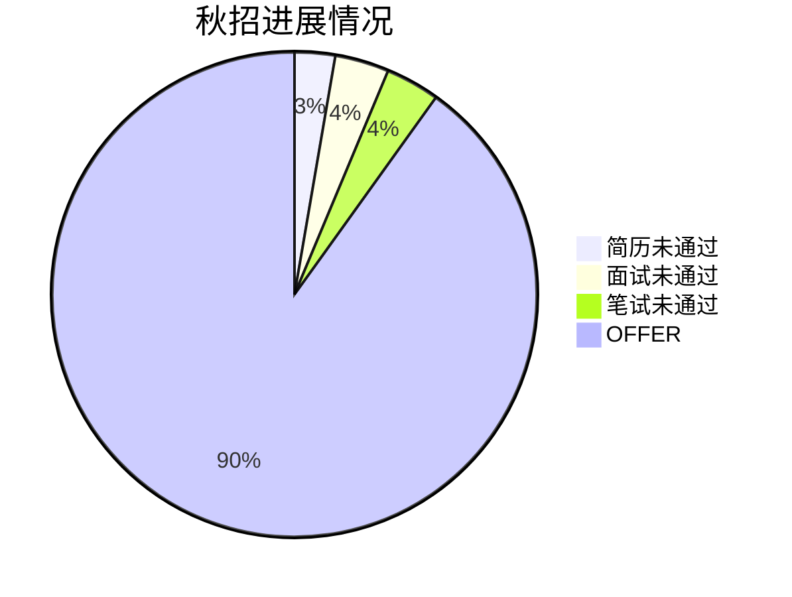

# CanpusCareers 收集整理
收集的面向自动驾驶、SLAM、DL、C/C++开发的招聘信息，方便学习和投递

> Created by leijobs876@gmail.com

### **目标方向：**

* C/C++ 开发
* Andorid 开发
* 深度学习部署
* 自动驾驶感知与定位
* ROS机器人开发

- [收集整理](#----)
    + [**目标方向：**](#---------)
    + [方向完全一致：](#-------)
  * [总体结果](#----)
    + [1、秋招进展框图](#1-------)
  * [1、互联网](#1----)
    + [1、京东 *](#1-----)
    + [2、网易 *](#2-----)
    + [3、百度 *](#3-----)
    + [4、字节跳动 *](#4-------)
    + [5、阿里巴巴 *](#5-------)
    + [6、腾讯 *](#6-----)
    + [7、快手 *](#7-----)
    + [8、奇虎360 *](#8---360--)
    + [9、拼多多 *](#9------)
    + [10、美团 *](#10-----)
    + [11、滴滴](#11---)
  * [2、自动驾驶](#2-----)
    + [1、元戎启行 *](#1-------)
    + [2、AutoX *](#2-autox--)
    + [3、智行者 *](#3------)
    + [4、小马智行](#4-----)
    + [5、图森未来 *](#5-------)
    + [6、Momenta *](#6-momenta--)
    + [7、四维图新 *](#7-------)
  * [3、硬件](#3---)
    + [1、华为 *](#1-----)
    + [2、小米 *](#2-----)
    + [3、海康威视 *](#3-------)
    + [4、商汤 *](#4---)
    + [5、中兴 *](#5-----)
    + [6、美的 *](#6-----)
  * [3、车企](#3---)
    + [1、蔚来](#1---)
    + [2、理想](#2---)
    + [3、上汽](#3---)
    + [4、三一](#4---)
    + [5、小鹏](#5---)
  * [4、机器人](#4----)
    + [1、大疆 *](#1-----)

<small><i><a href='http://ecotrust-canada.github.io/markdown-toc/'>Table of contents generated with markdown-toc</a></i></small>

### 方向完全一致：

1、大疆驾驶行为识别预警系统 [大疆智能驾驶核心零部件 - DJI大疆车载](https://auto.dji.com/cn/components?site=auto&from=footer)

2、移动端算法 [网易校园招聘 (163.com)](https://campus.163.com/app/detail/index?id=1406&projectId=39)

3、计算机视觉算法工程师 [网易校园招聘 (163.com)](https://campus.163.com/app/detail/index?id=1477&projectId=39)

## 总体结果

### 1、秋招进展框图

## 1、互联网

### 1、京东 *

|          岗位           |                         **工作内容**                         | 工作要求                                                     | 地点                                 | 备注（链接）                                                |
| :---------------------: | :----------------------------------------------------------: | ------------------------------------------------------------ | ------------------------------------ | ----------------------------------------------------------- |
|  **Android开发工程师**  | 1-负责Android端应用程序的研发，编写高质量代码，负责公司相应产品线的开发迭代；2-参与Android技术栈相关库、组件的设计开发，性能优化；3-探索学习移动端最新技术，扩展技术深度与宽度，提升研发效率。 | 专业要求：扎实的数据结构与算法基础、熟悉计算机基础知识、熟悉网络基础、熟悉Java语言、了解Android系统运行原理；项目经验要求：了解Android开发常用工具与常用模式，了解常用三方库的使用； | 北京/湖北武汉/上海/四川成都/广东深圳 | [京东校招 (jd.com)](http://campus.jd.com/#/details?id=1598) |
| **算法工程师-机器学习** | -与各业务、产品、工程团队配合，在京东亿量级的数据与丰富的业务应用场景中不断进行深入的机器学习（尤其在深度学习领域）算法研究和模型构建；2-对京东已有的算法和模型进行不断的优化及创新，不断丰富算法库内容，结合未来应用场景，为京东多元技术领域和业务提供全面的支持与解决方案；3-与京东的技术团队及科学家们一同参与人工智能、机器学习算法及应用的前沿研究 | 拥有但不限于计算机、信息工程、模式识别、人工智能、自动化、软件工程、数学等相关专业学习背景，熟悉常用机器学习算法，尤其在深度学习及相关领域有一定基础；3-至少熟悉Java、C/C++、python中的一门语言，有较强的编程能力，了解常用机器学习/深度学习框架，如：TensorFlow、Pytorch、Caffe等； | 北京/上海/四川成都/广东深圳          | [京东校招 (jd.com)](http://campus.jd.com/#/details?id=1508) |
|    **C++开发工程师**    | 1-负责面向互联网海量用户的高性能、高可用的技术系统的设计、开发和调优；2-负责电商的业务系统的需求分析和落地、业务能力建设；3-负责功能快速迭代。 | 2-有扎实的专业基础知识，熟悉常用的数据结构和算法，对计算机系统结构-网络-操作系统等专业知识有深刻认知；3-熟悉Linux/Unix平台上的C++编程，熟悉网络编程-多线程编程，有良好的编程习惯；4-有分布式系统开发、大数据处理开发经验者优先；5-有互联网企业实习经验优先； | 北京/四川成都/上海/广东深圳          | [京东校招 (jd.com)](http://campus.jd.com/#/details?id=1616) |
| **算法工程师-自动驾驶** | 1-与各业务、产品、工程团队配合，在京东亿量级的数据与丰富的无人物流、无人驾驶应用场景中不断进行深入的自动驾驶技术的研究，打造智慧物流、科技物流，开创无人驾驶的新格局；2-参与到京东自动驾驶的相关技术应用场景及开发中，包括但不限于：图像/视频/激光/雷达的分析、高精度地图的匹配/定位以及地图生成、动态路径规划、自动驾驶系统及标注、仿真开发等内容；3-与京东的技术团队及科学家们一同参与深度学习、图像/激光雷达分析与处理、决策算法、路径规划算法等前沿技术研究 | 2-拥有但不限于计算机、信息工程、模式识别、人工智能、自动化、软件工程、数学等相关专业学习背景，熟悉自动驾驶相关领域的技术知识，有一定实践经验更优；3-至少熟悉Java、C/C++、python中的一门语言，有较强的编程能力，有扎实的机器学习、深度学习等算法基础； | 北京                                 | [京东校招 (jd.com)](http://campus.jd.com/#/details?id=1510) |

### 2、网易 *

| 岗位                     | **工作内容**                                                 | 工作要求                                                     | 地点           | 备注（链接）                                                 |
| ------------------------ | ------------------------------------------------------------ | ------------------------------------------------------------ | -------------- | ------------------------------------------------------------ |
| **Android开发工程师**    | 负责Android平台移动应用的开发，平台的搭建是你，重要模块的设计是你，产品性能的优化是你 | 不管学的是什么专业，都有一颗对互联网无比热爱，愿意为之付出的心。 2、一心只对互联网开发感兴趣，一不小心还开发过几个app，有了丰富的项目经验； 3、喜欢动手实践，抗压能力强，遇到难题勇于死磕，不解出来不罢休； | 北京,杭州      | [网易校园招聘 (163.com)](https://campus.163.com/app/detail/index?id=1406&projectId=39) |
| **图像算法工程师**       | 负责计算机视觉核心技术和深度学习相关领域的算法研发与实现； 2、负责前沿计算机视觉算法与产品化落地，为产品提供算法模型和解决方案； 3、负责将计算机视觉算法移植到各个平台，并进行算法优化和调优； 4、跟踪学术界和业界最新的进展，并且快速应用到业务中； | 2、在计算机视觉、计算数学等一个或多个领域有较深入的研究，包括但不限于：数值计算、生成模型(GAN、VAE等)、手机端图像处理； 3、有扎实的数学和算法基础：概率统计、数值优化算法，并对图像处理算法有深刻理解； 4、熟练使用一种或几种深度学习框架(caffe, tensorflow, pytorch, mxnet等)； 5、较强的算法实现和编程能力，熟练掌握c/c++,python,Java等至少一门语言； 6、有科研经验，在国际顶刊、顶会上发表过论文者优先； 7、有深度学习算法在移动端移植优化经验者优先； | 北京,杭州      | [网易校园招聘 (163.com)](https://campus.163.com/app/detail/index?id=1406&projectId=39) |
| **C++开发工程师**        | 3、俗话说服务器就是战斗堡垒，所以你要维护线上部署服务，保证服务器质量和性能； 4、俗话说扩充基地是第一要义，所以存储新技术研究、开发也是你的职责，来靠你的聪明才智设计高性价比的存储系统吧； 5、俗话说云计算少不了技术支持，所以你要为它提供高性价比的数据库和存储解决方案。 | 1、不管学的是什么专业，都有一颗对互联网无比热爱，愿意为之付出的心； 2、就是喜欢C、C++这个程序语言，还就爱拿它做项目开发； 3、对网络编程有研究，基本的gdb调试能力？内存泄漏，越界读写等常见问题？对你来说都不是问题； 4、作为一个优秀的程序员，有良好的服务器端编程能力和编程习惯，相关模块设计、文档编写都是小case； 5、十八般武艺样样精通，掌握多线程并发编程技术，掌握各种数据结构和算法； 6、熟悉windows/linux编程环境，如果有MySQL开发经验那就再 好 | 北京,杭州,深圳 | [网易校园招聘 (163.com)](https://campus.163.com/app/detail/index?id=1497&projectId=39) |
| **计算机视觉算法工程师** | 1、探索计算机视觉及模式识别的最新技术； 2、相关算法工程化及产品化。 | 1、硕士及以上学历，模式识别、计算机视觉等相关专业； 2、对计算机视觉和模式识别方向有扎实的理论和实践基础； 3、有图像美化、人脸识别、图像检测、数字信号处理、智能硬件项目经验者优先； | 北京,杭州      | [网易校园招聘 (163.com)](https://campus.163.com/app/detail/index?id=1477&projectId=39) |

### 3、百度 *

| 岗位                                   | **工作内容**                                                 | 工作要求                                                     | 地点 | 备注（链接）                                                 |
| -------------------------------------- | ------------------------------------------------------------ | ------------------------------------------------------------ | ---- | ------------------------------------------------------------ |
| **C++/PHP/GO研发工程师**               | -负责百度核心产品功能和架构开发；-负责核心技术算法的研究、实现和优化；-负责前瞻技术的跟踪调研和产品创新 | 深刻理解计算机数据结构和算法设计，熟悉C/C++或PHP或GO编程语言；-了解Windows、Unix、Linux等主流操作系统原理，熟练运用系统层支持应用开发 | 北京 | 1000人[百度校园招聘 (baidu.com)](https://talent.baidu.com/external/baidu/campus.html#/jobDetail/all/1/192911) |
| **C++/PHP/GO研发工程师**               |                                                              |                                                              | 上海 | 150人[百度校园招聘 (baidu.com)](https://talent.baidu.com/external/baidu/campus.html#/jobDetail/all/1/192912) |
| **C++/PHP/GO研发工程师**               |                                                              |                                                              | 深圳 | 25人[百度校园招聘 (baidu.com)](https://talent.baidu.com/external/baidu/campus.html#/jobDetail/all/1/192913) |
| **C++/PHP/GO研发工程师**               |                                                              |                                                              | 成都 | 10人[百度校园招聘 (baidu.com)](https://talent.baidu.com/external/baidu/campus.html#/jobDetail/all/1/192990) |
| **计算机视觉算法研发工程师**           | 负责百度计算机视觉相关的技术(含无人车自定位、地图重建、图像点云物体识别分类算法、医疗影像AI分析）、系统、产品的研发工作-包括但不限于：移动图像技术应用、图像内容搜索、人脸检测识别、图像分类标注、OCR、增强现实、图像质量评价、图像处理、点云视觉定位、三维视觉重建、物体分类识别等 | 掌握计算机视觉和图像处理基本算法，并在如下一个或多个相关方向有较深入研究：移动图像技术应用、图像内容搜索、人脸检测识别、图像分类标注、OCR、增强现实、图像质量评价、图像处理、3D视觉 (如,Stereo,SLAM,VIO,SfM)、三维数据分析（如Semantic Segmentation,3D Reconstruction，Vision for graphics）、嵌入式优化 （FPGA，Arm programming）、机器人相关技术（如multi-sensor fusion，路径规划,控制）等；-了解机器学习基本算法，如分类、回归、聚类、概率模型等 | 北京 | 150人[百度校园招聘 (baidu.com)](https://talent.baidu.com/external/baidu/campus.html#/jobDetail/all/1/192923) |
| **计算机视觉算法研发工程师**           |                                                              |                                                              | 成都 | 5人[百度校园招聘 (baidu.com)](https://talent.baidu.com/external/baidu/campus.html#/jobDetail/all/1/192994) |
| **自动驾驶预测决策规划控制算法工程师** | -负责百度自动驾驶汽车预测决策规划控制系统的研发、调试和测试工作；-设计核心驾驶场景处理算法与策略,完成相关算法研发和效果验证，以及对应高效验证工具的设计开发等 | -预测方向需要熟悉常用机器学习深度学习算法-决策方向需要熟悉常见决策算法，例如有限状态机、决策树等或熟悉常用机器学习深度学习算法-规划方向需要熟悉常见路径规划算法(例如A*、D*、RRT等 )-控制方向需要熟练掌握模型预测控制，LQR，iLQR等基于优化的控制方法-具备较好编程能力，熟练掌握C++或Python-较好的沟通表达能力和团队合作意识具有以下条件者优先:-熟悉如MDP、POMDP、Game Theory等轨迹预测算法-有常用机器学习深度学习工具使用经验及实际项目经验-有ROS环境下开发经验，有机器人领域相关研发及竞赛经验或自动驾驶项目相关经验-熟练掌握CarSim、CarMaker等汽车仿真软件使用方法 | 北京 | 15人[百度校园招聘 (baidu.com)](https://talent.baidu.com/external/baidu/campus.html#/jobDetail/all/1/192928) |

### 4、字节跳动 *

| 岗位                    | **工作内容**                                                 | 工作要求                                                     | 地点 | 备注（链接）                                                 |
| ----------------------- | ------------------------------------------------------------ | ------------------------------------------------------------ | ---- | ------------------------------------------------------------ |
| SLAM算法工程师-智能创作 | 1、负责SLAM、三维重建、3D内容生成、3D Learning等前沿的技术研究与工程实现； 2、负责推动上述各类三维视觉算法在AR产品的落地。 | 2、熟悉多视角几何、三维视觉基础理论，在SLAM/VIO、SFM、PnP、特征点匹配、姿态估计、重定位、视角合成等方向上至少对一个方向有较深了解； 3、熟悉C++或Python，具有较强的代码开发能力； 4、熟悉渲染引擎、Android/iOS开发者优先；有移动端性能优化经验者优先； | 北京 | [SLAM算法工程师-智能创作 - 加入字节跳动 (bytedance.com)](https://jobs.bytedance.com/campus/position/6995206825097349407/detail) |

### 5、阿里巴巴 *

| 岗位                      | **工作内容**                                                 | 工作要求                                                     | 地点                                                    | 备注（链接）                                                 |
| ------------------------- | ------------------------------------------------------------ | ------------------------------------------------------------ | ------------------------------------------------------- | ------------------------------------------------------------ |
| **算法工程师-计算机视觉** | 1、负责图像/视频的分析、诊断、搜索、合成等方面的算法研究、系统研发和产品开发，包括图像检测、图像分类、图像分割、图像跟踪、视频语义分析、人脸识别与分析、车辆与人员的检测识别与跟踪、工业与医学诊断、图像/视频搜索、页面分析与自动合成、OCR等；2、负责图像/视频相关算法的前沿技术探索，包括机器学习方法以及深度学习在机器视觉中的应用，以及计算机视觉与自然语言处理、计算机图形学等相关领域的联合创新。 | 工程实现能力，熟练掌握C/C++、Java、Python等至少一门语言 ，ACM/ICPC、topcoder等编程比赛获奖者优先；3、 良好的科研能力，有成果发表在ICCV、CVPR、NeurIPS、ICML、TPAMI等国际顶级会议、期刊者优先 ； | 杭州市/北京市/上海市/深圳市/广州市                      | [阿里巴巴集团招聘官网 (alibaba.com)](https://talent.alibaba.com/campus-position/12686?spm=a1z9iw.13825115.0.0.60663ae77ns3Xb) |
| **机器人研发工程师**      | 其中涉及到机械结构, 电子工程, 软件系统, 自动控制, 动力系统, 嵌入式系统, 深度学习, 环境感知, SLAM, 避障与导航, 路径规划, 人机交互, 工业设计, 产品规划, 项目管理, 供应链管理等多个领域。 | \3. 系统软件岗位需熟悉Linux及开发环境, C++/Python/Java精通其一, 有多线程编程经验优先，有大型项目经验者优先； \4. 算法研发岗位需熟悉机器人算法或者深度学习算法，以下领域精通其一：SLAM, path/motion planning, control, object detection, semantic segmentation, sensor fusion & calibration。 | 杭州市/北京市                                           | [阿里巴巴集团招聘官网 (alibaba.com)](https://talent.alibaba.com/campus-position/12720?spm=a1z9iw.13825115.0.0.60663ae77ns3Xb) |
| **研发工程师C/C++**       | 参与基础软件的设计、开发和维护，如分布式文件系统、缓存系统、Key/Value存储系统、数据库、Linux操作系统等；如果你热衷于高性能分布式技术，你可以参与世界级规模的分布式服务端程序的系统设计，为阿里巴巴的产品提供强有力的后台支持，在海量的网络访问和数据处理中，设计并设施最强大的解决方案；如果你喜欢研究搜索技术，你可以参与搜索引擎各个功能模块的设计和实现，构建高可靠性、高可用性、高可扩展性的体系结构，满足日趋复杂的业务需求；如果你对电子商务产品技术感兴趣，你可以参与产品的开发和维护，完成从需求到设计、开发和上线等整个项目周期内的工作；如果你热衷于客户端开发，你可以参与为用户提供丰富且有价值的桌面或无线软件产品。 | 酷爱着计算机以及互联网技术，热衷于解决挑战性的问题；或许，你痴迷于数据结构和算法，热衷于ACM，常常为看到“accept”而兴奋的手足舞蹈；或许，你熟悉Unix/Linux/Win32环境下编程，并有相关开发经验，熟练使用调试工具，并熟悉某种脚本语言；或许，你熟悉网络编程和多线程编程，对TCP/IP，HTTP等网络协议有很深的理解；或许，你享受底层技术，在kernel的源代码中纵横驰骋；或许，你并不熟悉C，C++，但是你不畏挑战，喜欢钻研，能够用你亮眼的成果证明自己超强的学习能力；或许，你参加过大学生数学建模竞赛，“挑战杯”，机器人足球比赛等； | 杭州市/北京市/上海市/广州市/成都市/深圳市/南京市/厦门市 | [阿里巴巴集团招聘官网 (alibaba.com)](https://talent.alibaba.com/campus-position/12695?spm=a1z9iw.13825115.0.0.60663ae77ns3Xb) |
| **算法工程师-自动驾驶**   | 1、负责图像视频/激光雷达的分析，包括检测、分类、分割、跟踪、语义分析等等；2、负责基于高精度地图的匹配，跟踪，定位，以及高精度地图的生成；3、负责开发基于驾驶环境的决策，局部路径规划，动态路径规划等技术；4、负责开发稳定的控制算法；5、负责开发自动驾驶的软件系统，以及标注和仿真工具等。 | 2、熟悉深度学习、图像/激光雷达分析与处理、决策算法，路径规划算法，三维重建与绘制、游戏开发等相关领域技术和应用，有大量实践经验者优先；3、有科研能力并有成果发表在国际顶级会议、期刊者优先；4、极佳的工程实现能力，熟练掌握C/C++、Java、Python等至少一门语言； | 杭州市/北京市/上海市                                    | [阿里巴巴集团招聘官网 (alibaba.com)](https://talent.alibaba.com/campus-position/12689?spm=a1z9iw.13825115.0.0.60663ae77ns3Xb) |

### 6、腾讯 *

| 岗位                            | **工作内容**                                                 | 工作要求                                                     | 地点                                   | 备注（链接）                                                 |
| ------------------------------- | ------------------------------------------------------------ | ------------------------------------------------------------ | -------------------------------------- | ------------------------------------------------------------ |
| **软件开发-PC客户端开发方向**   | Windows操作系统的内存管理、文件系统、进程线程调度；  MFC/Windows界面实现机制。 可以加分的： Windows 应用软件开发经验。 | 计算机软件相关专业本科或以上学历，良好的算法基础及系统分析能力； 热爱编程，基础扎实，理解算法和数据结构相关知识； 熟练掌握VC、C/C++、STL语言； Windows下的网络编程经验；掌握Windows客户端开发、调试技能； | 广州 深圳总部 成都 上海 北京           | [岗位详情 \| 腾讯校园招聘 (qq.com)](https://join.qq.com/post_detail.html?pid=1&id=102&tid=2) |
| **软件开发-移动客户端开发方向** |                                                              | 热爱编程，基础扎实，理解算法和数据结构相关知识；  至少掌握一种编程语言。 可以加分的： C/C++/Java编程经验优先； iOS、Android、Windows Phone开发经验。 | 北京 广州 成都 深圳总部 上海 武汉 合肥 | [岗位详情 \| 腾讯校园招聘 (qq.com)](https://join.qq.com/post_detail.html?pid=1&id=103&tid=2) |
| **技术研究-计算机视觉方向**     | CVPR、ICCV、ECCV、ICML、NeurIPS、COLT                        | 包含但不限于计算机、信息工程、模式识别、人工智能、自动化、软件工程、电子工程、统计学、应用数学、物理学/量子计算、信息安全、信号与信息处理等专业的博士和优秀硕士； 熟练掌握计算机视觉和图像处理相关的基本算法及应用，熟悉caffe、tensorflow，pytorch等至少一个深度学习框架； 较强的工程实现能力，熟练掌握 C/C++ 编程，熟悉 Shell/Python/Matlab 至少一种编程语言。 | 深圳总部 北京 广州 上海 成都 杭州      | [岗位详情 \| 腾讯校园招聘 (qq.com)](https://join.qq.com/post_detail.html?pid=1&id=177&tid=2) |

### 7、快手 *

| 岗位                               | **工作内容**                                                 | 工作要求                                                     | 地点      | 备注（链接）                                                 |
| ---------------------------------- | ------------------------------------------------------------ | ------------------------------------------------------------ | --------- | ------------------------------------------------------------ |
| **C++开发工程师**                  | 1、负责快手各产品后端系统、平台系统的研发工作，通过敏捷开发支持产品需求快速迭代，不断优化系统架构，支撑业务规模增长，保障服务稳定； 2、对现有系统的不足进行分析，找到目前系统的瓶颈，改进提高系统性能； | 2、熟悉C/C++或Rust，有扎实的计算机基础，对数据结构、算法基础有深入理解； 3、熟悉面向对象的设计思想，了解软件开发流程； 4、有实际项目经验或互联网公司实习经历者优先，有OI、ICPC等竞赛经验者优先； | 北京      | [快手校招 - 职位详情 (kuaishou.cn)](https://campus.kuaishou.cn/recruit/campus/e/#/campus/job-info/1962) |
| **计算机视觉算法工程师-美颜/美妆** | 1、推进计算机视觉的技术前沿，为用户创造差异化的体验，业务场景包括但不限于短视频/直播/商业化/美颜特效等； 2、负责美颜、美妆算法的研发和优化，分析并解决实际业务问题。 | 1、硕士及以上学历，计算机/数学相关专业优先； 2、优秀的代码能力， 熟悉Java/Python/C/C++语言，可在Linux下进行测试工具开发； 3、熟练掌握OpenGL/Metal/Vulkan中的一种； 4、了解机器学习、深度学习基本原理;3、有实际AI产品/项目的研发和落地经验。 | 深圳/北京 | [快手校招 - 职位详情 (kuaishou.cn)](https://campus.kuaishou.cn/recruit/campus/e/#/campus/job-info/1943) |
| **计算机视觉算法工程师-人脸/人体** | 1、推进计算机视觉的技术前沿，为用户创造差异化的体验，业务场景包括但不限于短视频/直播/商业化/美颜特效等； 2、负责人脸/人体的感知、重建、理解、生成等方向的研发和落地，分析并解决实际业务问题。 | 2、熟练掌握Python及C/C++，熟悉常用AI框架、模型结构及训练方法； 3、扎实的数学和算法功底，对人脸/人体的感知、重建、理解、生成等方向感兴趣；3、有人脸/人体相关的实际项目落地经验。 | 北京      | [快手校招 - 职位详情 (kuaishou.cn)](https://campus.kuaishou.cn/recruit/campus/e/#/campus/job-info/1944) |
| **视觉识别与检索算法工程师**       | 1、负责图像分类模型、目标检测、超大规模视觉检索算法、手写OCR、人脸识别等深度学习模型和算法的研究与落地； 2、用于短视频和直播场景的语义表征，质量衡量体系，以图搜视频，大规模原创查重，主站推荐和主站搜索业务。 | 2、在模式识别、OCR、图像检索等方面有研究及实践经验； 3、熟练使用C/C++或Python，熟悉OpenCV、Matlab等常用算法库； 4、有较强的文献阅读和算法实现能力。 | 北京      | [快手校招 - 职位详情 (kuaishou.cn)](https://campus.kuaishou.cn/recruit/campus/e/#/campus/job-info/1946) |

### 8、奇虎360 *

| 岗位               | **工作内容**                                                 | **工作要求**                                                 | **地点** | **备注（链接）**                                             |
| ------------------ | ------------------------------------------------------------ | ------------------------------------------------------------ | -------- | ------------------------------------------------------------ |
| **AI算法工程师**   | 1. 负责人脸识别、图像识别、语音识别等AI模型的攻击以及防御技术研究    2. 负责AI技术在大数据分析、未知威胁检测、流量分析漏洞挖掘等场景的应用研究； 3. 负责深度学习平台的搭建，已有算法的优化与改进； | 2. 熟悉Tensorflow、PyTorch等常见的机器学习开发框架；    3. 熟悉常见的机器学习算法和深度学习算法，有扎实的数学基础；    4. 熟练掌握Python开发，有相关图像识别、语音识别等相关项目经历者优先； | 北京     | [360集团 - 校园招聘 (mokahr.com)](https://app.mokahr.com/campus_apply/360campus/26419#/job/51537b19-532b-426f-a3f6-4f56b25b4514) |
| **SLAM算法工程师** |                                                              | 1、负责移动机器人的定位、建图、避障等相关算法的研发。    1、控制工程、机械、电子、计算机相关专业，本科及以上学历；    2、扎实的数学基础，掌握SLAM基本理论和算法，熟悉常用的激光、视觉SLAM框架，对State Estimation，Mutil-Sensor  fusion算法有深入理解，有移动机器人/自动驾驶车辆定位导航相关竞赛或项目经验者优先；    3、熟悉C++编程，熟练掌握常用算法与数据结构 ；熟悉Linux编程和常用的调试工具 ； | 北京     | [360集团 - 校园招聘 (mokahr.com)](https://app.mokahr.com/campus_apply/360campus/26419#/job/aa898252-c8ce-4808-b5f7-f57d1c85db06) |

### 9、拼多多 *

| 岗位           | **工作内容**                                                 | 工作要求                                                     | 地点 | 备注（链接）                                                 |
| -------------- | ------------------------------------------------------------ | ------------------------------------------------------------ | ---- | ------------------------------------------------------------ |
| **算法工程师** | \1. 利用机器学习/深度学习技术/图计算技术，优化拼多多搜索、推荐、广告、图像、风控、智能客服、平台治理等效果，提升数亿用户的购物体验和平台的变现效率； 2. 深入产品和业务，发现算法和机制中的不足，提出改进方案并且推动实现； 3. 跟踪业界和学术界最新进展，将理论成果应用到业务场景，提升业务效果。 | \2. 具备强悍的编码能力，熟悉 linux 开发环境，熟悉Hadoop/Hive优先； 3. 具备扎实的数据结构功底，熟悉机器学习、深度学习、图计算、自然语言处理、数据挖掘、分布式计算中一项或多项； 4. 对搜索引擎、推荐系统、计算广告、图像、互联网风控、智能客服、平台治理等相关领域有经验者优先； | 上海 | [拼多多校园招聘 (pinduoduo.com)](https://careers.pinduoduo.com/campus/grad/detail?positionId=5b857121-05f7-47d0-81aa-2fc41a37d1f7) |

### 10、美团 *

* 注：最多只能申请一个，若申请多个，则以最近的申请为准

| 岗位                                  | **工作内容**                                                 | 工作要求                                                     | 地点                | 备注（链接）                                                 |
| ------------------------------------- | ------------------------------------------------------------ | ------------------------------------------------------------ | ------------------- | ------------------------------------------------------------ |
| **语音算法工程师**                    | 1.语音识别、语音合成、声纹识别相关专业，或有相关项目经验者优先；2.在InterSpeechICASSP等语音会议或期刊中有论文发表者优先。 | 1.工程基础能力扎实，数量掌握Python和C++；2.对机器学习、深度学习算法具备扎实的知识基础，并有项目实践尝试，熟练掌握算法流程和数据处理方法。 | 北京/上海           | [职位列表 \| 美团招聘官网 (meituan.com)](https://campus.meituan.com/jobs?jobId=4077&jobType=1&pageNo=3) |
| **移动端开发工程师**                  | 1.热爱移动（前端）开发，对使用自己代码直接服务亿万用户着迷；或者是技术极客，对写出完美代码有执着者；2.具备扎实的计算机基础，包括算法、数据结构、计算机网络，编译原理，操作系统等领域基础知识；3.熟悉某个移动平台（如iOS/Android）的平台工作机制、体系架构，掌握该平台的开发语言（如Objective-C/Swift/Java/Kotlin），并熟练使用相关的开发平台；4.掌握至少一门其他开发语言（如C/C++/Go/Rust/Java/Python/Ruby/JavaScript/Dart等），并有一定的实践经验。 | 1.有实际移动端，前端或PC端实际项目经验；2.有关注并实践混合前端（如RN，Flutter）等技术者优先；3.建立/参与开源项目者，或有自己长期坚持的技术博客； | 北京/上海/成都/深圳 | [职位列表 \| 美团招聘官网 (meituan.com)](https://campus.meituan.com/jobs?jobId=4137&jobType=1&pageNo=3) |
| **无人车工程师**                      | 1.计算机或相关专业本科及以上学历；2.扎实的计算机理论基础；3.优秀的算法和数据结构能力；4.熟练掌握至少一门主流开发语言，能编写高效且易读的代码；5.强烈的责任心和工作积极性。 | 1.NOI、ACM获奖经历或其他能证明学习能力的亮眼成果；2.在相关领域如计算机视觉、激光处理算法、机器学习、SLAM、操作系统、机器人等领域发表高质量论文； | 北京/深圳           | [职位列表 \| 美团招聘官网 (meituan.com)](https://campus.meituan.com/jobs?jobId=4109&jobType=1&pageNo=3) |
| **计算机视觉工程师**                  | 1.负责通用视觉识别能力的构建，包括文字识别，人脸和人体分析，图像和视频理解，增强现实等；2.负责视觉技术在美团全场景的落地，包括但不限于线上信息流的内容审核、身份认证、门店数字化、视觉交互等。 | 1.熟练掌握模式识别和图像处理领域的基础理论和方法，在一个或多个领域有深入研究：OCR、人脸识别、大规模图像分类与检索、物体识别、视频结构化分析等；2.在机器学习和深度学习方面具备扎实的理论基础和工程能力，熟悉TensorFlow、Caffe、MXNet等主流框架； | 北京/上海           | [职位列表 \| 美团招聘官网 (meituan.com)](https://campus.meituan.com/jobs?jobId=4097&jobType=1&pageNo=9) |
| **【北斗】无人车障碍物预测/决策规划** | 1.基于美团配送业务场景，提供无人车障碍物预测、主车行为决策、运动规划和控制的解决方案；2.基于机器学习、优化方法的相关模型的建立与实践，改进当前预测、决策、规划、控制的效果； | 2.具有丰富的Linux系统开发经验，熟知基本算法和算法优化的方法和思路；3.良好的数据结构和算法基础，熟悉C/C++、Python或者一种编程语言；4.具有机器人、无人车或无人机相关算法开发经验。 | 北京/深圳           | [职位列表 \| 美团招聘官网 (meituan.com)](https://campus.meituan.com/jobs?jobId=3869&jobType=1&pageNo=10) |
| **【北斗】无人车感知算法工程师**      | 1.负责感知模块的算法功能研发，具体分支方向包括但不限于：视觉2D/3D检测、激光点云分割、3D检测、目标跟踪、行人检测、属性分析与行为理解、模型加速、轻量化与部署、图像分割与场景理解、多传感器数据融合处理；2.负责感知模块的系统集成与运营测试迭代优化，包括对不同场景下感知问题的优化求解，提升感知系统的复杂场景处理能力和模块稳定性。 | 1.熟练掌握机器学习/计算机视觉/激光雷达信号处理/多源数据融合处理等领域的基础理论和方法，在以下一个或多个领域有深入研究：机器人技术、视觉识别与检测、图像分割、激光3D检测、毫米波处理、目标跟踪、深度学习模型加速与轻量化、小样本学习、迁移学习、多模态学习；2.在机器学习和深度学习方面具备扎实的理论基础和工程能力，熟悉PyTorch、TensorFlow等主流框架； | 北京/深圳           | [职位列表 \| 美团招聘官网 (meituan.com)](https://campus.meituan.com/jobs?jobId=3865&jobType=1&pageNo=10) |

### 11、滴滴

目前空白 [滴滴招聘 (didiglobal.com)](https://talent.didiglobal.com/)

## 2、自动驾驶

### 1、元戎启行 *

| 岗位                       | **工作内容**                                                 | 工作要求                                                     | 地点                     | 备注（链接）                                                 |
| -------------------------- | ------------------------------------------------------------ | ------------------------------------------------------------ | ------------------------ | ------------------------------------------------------------ |
| **高性能计算工程师**       | 1、开发和优化inference框架；2、并行化神经网络加速的技术探索和落地。 | 2、精通c/c++，精通算法与数据结构，熟悉python；3、具备较好的计算机体系结构背景和软件开发背景，熟悉gpu硬件,  熟悉gpu内核函数优化；4、了解深度学习基本原理，熟悉神经网络基本架构和各layer计算方式，熟悉至少一种深度学习训练框架及其模型文件的解析，如caffe、tensorflow、pytorch；5、了解常用图像视觉计算库及深度学习推理计算库；6、了解常用的卷积计算加速方法，如gemm、winograd算法等；7、了解深度学习定点化计算，熟悉支持定点化的深度学习训练框架如ristretto，熟悉支持定点化的推理引擎计算库如qnnpack等； | 广东·深圳市北京市·海淀区 | [深圳元戎启行科技有限公司 - 校园招聘 (mokahr.com)](https://app.mokahr.com/campus_apply/deeproute/6487#/job/58f83143-e35d-4aec-8da0-e2d5deb9c688) |
| **预测算法工程师**         | 负责自动驾驶场景下物体（车辆/行人/自行车）的行为轨迹预测算法的研发以及系统集成。 | 2、扎实的C++/Pyhton编程基础，熟悉数据结构、设计模式等；3、熟悉机器学习相关算法（LR，MLP，LSTM等）；4、熟悉行为预测相关算法；5、熟悉深度学习，有pytorch/tensorflow等开发经验优先；6、有自动驾驶物体目标行为预测相关经验者优先。 | 北京市·海淀区广东·深圳市 | [深圳元戎启行科技有限公司 - 校园招聘 (mokahr.com)](https://app.mokahr.com/campus_apply/deeproute/6487#/job/922d9da5-babd-4bc2-bea4-6d5b07499c0f) |
| **软件工程师**             | 深度参与无人驾驶硬件驱动，算法，运营平台，后台系统等模块的开发。推进L4级别无人驾驶成为更智能，更高效，更安全的人类出行方式。 | 1、熟练掌握C/C++, Python, Java,  C#,  Javascript或Go中至少一门开发语言；2、有Linux平台上的开发经验，有ROS开发经验，熟练掌握Git等工具；3、对学习新知识充满热情。愿意学习新的编程语言，软件开发技能以及无人驾驶领域的新知识； | 北京市·海淀区广东·深圳市 | [深圳元戎启行科技有限公司 - 校园招聘 (mokahr.com)](https://app.mokahr.com/campus_apply/deeproute/6487#/job/d38609fe-1604-4ad1-923b-7b9627df98d1) |
| **计算机视觉算法工程师**   | 1、负责计算机视觉关键算法研发，包括不限于目标检测、识别，关键点检测等算法研发；2、负责自动驾驶场景下视觉感知算法落地与系统集成。 | 1、具备扎实的编程实现能力，熟练使用C++/ Python；2、熟练掌握计算机视觉和机器学习相关的理论知识和实践技能；3、有AI相关经验者优先，有使用Caffe/TensorFlow/Pytorch等平台经验者优先; 4、有图像处理/GPU算法优化经验者优先； | 广东·深圳市北京市·海淀区 | [深圳元戎启行科技有限公司 - 校园招聘 (mokahr.com)](https://app.mokahr.com/campus_apply/deeproute/6487#/job/7785f274-01a6-4133-8fe1-bcc61f1ea45e) |
| **规划算法工程师**         | 开发无人驾驶车辆的行为决策和路径规划算法。                   | 1、 在相关领域的（机器人，计算机，自动化，计算数学等）BS/MS/PhD ；2、 精通Linux 环境下C++编程，具有良好的OOP设计习惯，有在相关系统（机器人、无人机或车）平台上开发/实现相关算法模块的经验；3、 熟悉常见轨迹生成及规划算法（A*,RRT*，Lattice based，MPC，Apollo EM）或者行为决策模型（POMDP等） ；4、良好的数学基础，熟悉数值计算、数值优化相关的知识； | 广东·深圳市北京市·海淀区 | [深圳元戎启行科技有限公司 - 校园招聘 (mokahr.com)](https://app.mokahr.com/campus_apply/deeproute/6487#/job/d9496a0d-5149-4b6f-a864-29f27d35db71) |
| **SLAM 算法工程师**        | 研发无人驾驶车辆定位和建图算法。                             | 1、 熟悉主流SLAM源码框架，如OKVIS, VINS-MONO, LIO-Mapping, LIO-SAM等；2、 熟悉Kalman filter及其在现实场景中的应用；3、对LiDAR, IMU有深入的了解，并有丰富的数据处理的经验。4、有大型合作项目中的C++开发经验。 | 广东·深圳市北京市·海淀区 | [深圳元戎启行科技有限公司 - 校园招聘 (mokahr.com)](https://app.mokahr.com/campus_apply/deeproute/6487#/job/9e1b1643-1b26-4f89-8d07-f123ba14213d) |
| **激光雷达感知算法工程师** | 1、负责无人驾驶场景中激光雷达感知或者多传感器融合感知算法开发与优化，包括但不限于目标检测、目标分类、点云分割、点云补全和目标Tracking等算法研发；2、在机器学习、深度学习和强化学习领域前沿展开创新性的研究，探索无人车感知解决方案的新方向。 | 1、具备扎实的编程实现能力，熟练使用C++，Python等编程语言；2、熟练掌握计算机视觉和机器学习相关的理论知识和实践技能，有Lidar点云相关算法研究经验者优先，有多传感器器融合相关算法研究经验者优先；3、有AI相关经验者优先，有使用Caffe/TensorFlow/Pytorch等平台经验者优先;4、有GPU算法优化经验者优先；5、熟悉点云感知前沿算法 | 广东·深圳市北京市·海淀区 | [深圳元戎启行科技有限公司 - 校园招聘 (mokahr.com)](https://app.mokahr.com/campus_apply/deeproute/6487#/job/86d85609-b9b3-4672-a364-fd179f656bfe) |

### 2、AutoX *

| 岗位                               | **工作内容**                                                 | 工作要求                                                     | 地点                 | 备注（链接）                                                 |
| ---------------------------------- | ------------------------------------------------------------ | ------------------------------------------------------------ | -------------------- | ------------------------------------------------------------ |
| **定位算法工程师（北京）**         | 1.主要负责对视觉、激光雷达、GPS、IMU、车轮编码器等多源数据的建模与融合，实现无人车在复杂环境下的自主定位。 | 1.具备较强的C++编程能力；2.熟悉LSD-SLAM、ORB-SLAM、VINS、LOAM、NDT、Cartographer、卡尔曼滤波等算法框架。3.熟悉GPS、激光雷达、相机等传感器参数模型。 | 北京海淀区           | [AutoX无人驾驶 - 社会招聘 (mokahr.com)](https://app.mokahr.com/apply/autox/6312#/job/e2487df9-c6ed-4d70-81f5-211acb20c6f7) |
| **行为预测算法工程师**             | 1.开发无人驾驶系统的行为预测算法。                           | 1. 熟悉行为预测相关算法（单/多智能体交互等）2. 熟悉目标跟踪相关算法（单/多智能体追踪，Kalman filter等）3. 熟悉机器学习相关算法（MLP，SVM，深度学习等）4. 有机器学习开发经验（数据预处理，模型训练，模型验证等）5. 熟悉轨迹生成相关算法（A*，RRT，Lattice planner等）6. 有扎实的C++编程基础（算法，数据结构等）7. 相关专业本科以上学历（机器人，计算机，自动化，数学等） | 北京海淀区/上海/广州 | [AutoX无人驾驶 - 社会招聘 (mokahr.com)](https://app.mokahr.com/apply/autox/6312#/job/966cc73e-5673-44a2-9806-7f5df1167ea2) |
|                                    |                                                              |                                                              |                      |                                                              |
| **自动驾驶系统集成工程师（上海）** | 1、系统集成，传感器校准和平台集成；2、调试/解决系统层问题；3、根据需求管理开发方案和进度；4、整合传感器，控制以及算法到无人车系统；5、设计/编写软件用于提高开发/测试效率。 | 1、计算机工程，电子工程或相关专业本科／硕士，知名院校；2、具备系统和软件工程领域1-3年工作经验；3、有ROS使用经验；4、具备整合复杂机械，硬件系统和软件系统的经验；5、熟悉或精通控制以下任意领域：决策，定位，规划，导航，视觉检测，控制6、了解Linux系统开发，优秀的C / C ++编程技能，优秀的Python/Shell脚本编程技能； | 上海市·嘉定区        | [AutoX无人驾驶 - 社会招聘 (mokahr.com)](https://app.mokahr.com/apply/autox/6312#/job/d6edfe30-b078-4d91-89ea-6540130080df) |
| **决策规划算法工程师（深圳）**     | \1. 开发无人驾驶系统的行为规划和路径规划算法；               | 1. 熟悉路径规划相关算法（A*，RRT，Lattice planner等）2. 熟悉决策规划相关算法/框架（FSM，MDP，Decision Tree等）3. 熟悉强化学习相关算法（DQN，CheufferNet等）4. 有良好的数学基础（几何，统计，图形学，优化等）5. 有良好的机器学习基础6. 有扎实的C++编程基础（算法，数据结构等） | 广东·深圳市          | [AutoX无人驾驶 - 社会招聘 (mokahr.com)](https://app.mokahr.com/apply/autox/6312#/job/57b26f37-ac09-4cd7-a28e-6decce155d0a) |
| **视觉算法工程师**                 | 1、在无人车定位导航项目中，负责基于不同sensor的建图定位算法的研发；2、在无人车感知项目中，负责基于不同sensor的物体检测和跟踪的算法研发；3、视觉传感器(Camera, Lidar, etc.)的标定，基于深度信息或图像信息的三维重建方向的研发；4、随时跟踪视觉导航、无人车智能领域的发展方向和趋势。 | 2、熟练掌握C/C++， Python等程序语言，熟悉常见的图形图像3D处理SDK，如OpenCV， PCL， Eigen等；3、掌握计算机视觉和3D处理领域基础理论和算法，具备以下项目经验者优先，如Visual SLAM，Lidar SLAM, 双目相机Stereo Matching，object detection/tracking等；4、熟悉Linux下的程序开发与调试。具有扎实的数学功底 | 广东·深圳市          | [AutoX无人驾驶 - 社会招聘 (mokahr.com)](https://app.mokahr.com/apply/autox/6312#/job/b6739abf-f6cd-4648-8d52-7070311f7169) |
| **传感器标定工程师**               | 1.对无人车各类传感器（camera, Lidar, Radar, IMU、Magnetic、GPS...）做信号处理，提取传感器姿态和运动信息；2.负责传感器标定方法实现以及开发。 | 2.熟练掌握线性代数，立体几何，优化以及算法结构；了解特征提取，位姿优化，相机标定，立体视觉，雷达或者相机SLAM;3.熟悉C/C++语言以及Linux系统开发；4.具有较强算法设计与实现能力； | 北京/上海/深圳       | [AutoX无人驾驶 - 社会招聘 (mokahr.com)](https://app.mokahr.com/apply/autox/6312#/jobs?zhineng=47504&page=1) |
| **自动驾驶测试工程师（上海）**     | 1.根据功能和系统测试需求，编写测试用例；2.操作自动驾驶车辆系统，在无人驾驶平台上进行仿真测试以及在公开道路上进行实车测试；3.记录、分析、定位、分类、整理、反馈并跟踪日常道路测试问题；4.配合协助研发工程师进行软硬件维护以及问题修复。 | 1.计算机相关专业背景，熟悉Linux系统、git操作；2.熟悉C++和python编程语言；3.良好的沟通能力、分析能力和表达能力； | 上海市·嘉定区        | [AutoX无人驾驶 - 社会招聘 (mokahr.com)](https://app.mokahr.com/apply/autox/6312#/job/4c894bf0-7c87-4f6e-9731-21aac324d933) |
| **深度学习开发工程师**             | 1、负责计算机视觉或深度学习算法相关的前沿技术研发工作；2、负责图像或三维点云中的目标检测、分割等相关算法研发工作；3、负责深度学习算法的模型优化、加速与部署； | 1、硕士及以上学历，计算机相关专业，2年以上深度学习工作经验；2、熟练使用c/c++，有优秀的算法基础；3、深刻理解机器学习、深度学习等相关知识；4、熟练掌握至少一种Deeplearning框架，拥有实际项目经验；5、以下几个子方向至少在其中一个有专长：  1）对网络结构设计、训练、大规模数据处理有丰富的实践经验;  2) 对深度学习模型优化、模型加速、模型压缩等有相关经验；  3）熟悉CUDA/OpenCL开发，对模型部署有相关经验;  4）对半监督/无监督学习相关方法有一定经验和了解。 | 上海/广州            | [AutoX无人驾驶 - 社会招聘 (mokahr.com)](https://app.mokahr.com/apply/autox/6312#/job/cf85c6e5-aaad-407c-b020-7901c3df70d8) |

### 3、智行者 *

| 岗位               | **工作内容**                                                 | 工作要求                                                     | 地点                   | 备注（链接）                                                 |
| ------------------ | ------------------------------------------------------------ | ------------------------------------------------------------ | ---------------------- | ------------------------------------------------------------ |
| **定位算法工程师** | \1. 负责自动驾驶汽车激光/视觉SLAM算法.高清地图创建及特征匹配定位的研发工作\2. 参与自动驾驶汽车高清地图创建及多传感器融合定位相关工作工程化实现 | 1.机器人.自动化.电气工程.机械自动化等相关专业等相关专业硕士及以上学历2.掌握激光雷达/视觉SLAM定位方法，具备较好的编程能力，熟练掌握C/C++或Python编程语言3.有Linux下编程开发经验为佳，有ROS编程开发经验为佳 | 北京, 合肥, 重庆, 武汉 | [北京智行者科技有限公司招聘官网 - 定位算法工程师-2022校招 (gllue.com)](https://idriverplus.gllue.com/portal/portalposition/detail?id=210) |
| **感知算法工程师** | \1. 负责无人驾驶汽车感知算法的核心技术研发工作；\2. 参与无人驾驶汽车车载系统的工程化实现工作；\3. 用视觉识别和理解复杂环境，为视觉主导的无人驾驶系统在感知和定位方面提供强有力的支撑。 | \1. 具有计算机视觉、模式识别、机器学习、三维视觉与点云处理等相关专业硕士及以上学历，博士优先；\2. 有物体检测、识别、跟踪；场景分割、理解；立体视觉等领域研发经验；\3. 具备较好的编程能力，熟练掌握C/C++编程语言，熟悉Linux或ROS；\4. 熟悉图像识别领域的常见工具； | 北京, 合肥, 重庆, 武汉 | [北京智行者科技有限公司招聘官网 - 感知算法工程师-2022校招 (gllue.com)](https://idriverplus.gllue.com/portal/portalposition/detail?id=208) |
| **规控算法工程师** | 1.负责自动驾驶车辆底层控制系统的建模；2.研发适用自动驾驶乘用车和特种车辆的纵/横向控制算法；3.负责自动驾驶控制算法的模型开发.调试与实车验证；4.与自动驾驶其他模块工程师协同完成系统集成和调试工作。 | 1.硕士及以上学历，熟练掌握C++.Python；2.熟悉Linux和ROS，熟悉ROS下机器人系统的研发；3.熟悉经典控制理论和现代控制理论的基本方法； | 北京, 合肥, 重庆, 武汉 | [北京智行者科技有限公司招聘官网 - 规控算法工程师-2022校招 (gllue.com)](https://idriverplus.gllue.com/portal/portalposition/detail?id=214) |
| **C++开发工程师**  | 1.负责自动驾驶产品业务软件开发；2.负责自动驾驶咨询服务项目软件开发、调试与实施；3.负责业务软件与算法模块的集成调试。 | 1.计算机/电子/车辆/自动化等相关专业，本科及以上学历；2.熟练掌握C/C++编程技术，具备较好的编程能力，熟悉Linux开发环境；3.熟练掌握Socket网络编程，多线程编程和基本数据结构；4.具备ROS开发经验者优先；具备QT应用软件开发者优先。 | 北京, 合肥, 重庆, 武汉 | [北京智行者科技有限公司招聘官网 - C++开发工程师-2022校招 (gllue.com)](https://idriverplus.gllue.com/portal/portalposition/detail?id=216) |
| **测试工程师**     | \1. 制定自动驾驶产品测试计划.测试方案.开发测试用例；2.执行实车自动驾驶测试.收集自动驾驶测试数据.撰写自动驾驶测试报告。3.能够在测试过程中记录相关测试数据，正确上报问题。 | 2.熟悉Linux系统，了解基本的命令行操作。3.有系统测试相关工作经验，有ADAS或自动驾驶相关测试经验者优先。 | 北京, 重庆, 武汉       | [北京智行者科技有限公司招聘官网 - 校园招聘 (gllue.com)](https://idriverplus.gllue.com/portal/portalposition/detail?id=209) |

### 4、小马智行 

[小马智行 Pony.ai - 社会招聘 (mokahr.com)](https://app.mokahr.com/apply/pony/2736#/jobs?location=深圳市&_k=l9qolx)

* 没有任何校园招聘

### 5、图森未来 *

[图森未来招聘 (mokahr.com)](https://app.mokahr.com/campus_apply/tusenweilai/3232#/jobs?zhineng=67372&page=1)

* 算法类-校招

| 岗位                                     | **工作内容**                                                 | 工作要求                                                     | 地点                       | 备注（链接）                                                 |
| ---------------------------------------- | ------------------------------------------------------------ | ------------------------------------------------------------ | -------------------------- | ------------------------------------------------------------ |
| **定位与高精地图算法研究员**             | 1、使用多源传感器（包括但不限于相机与LiDAR）开发基于不同依据的高精度定位模块，用于自动驾驶中分米级别的高精度定位； 2、处理多源传感器与定位算法输出结果的融合； 3、综合使用相关知识，完成大规模自动化的多源传感器标定（包括但不限于相机、LiDAR、IMU）。 | 1、熟悉计算机视觉中多视角几何知识； 2、熟悉常用vSLAM，VO/VIO或LiDAR SLAM算法，有实际动手或项目经验； 3、熟悉基于滤波和优化的状态估计算法，并可以灵活运用解决实际问题； 4、熟悉python, c++，有很强的动手能力。 | 上海市·杨浦区北京市·朝阳区 | 25K-50K[图森未来招聘 (mokahr.com)](https://app.mokahr.com/campus_apply/tusenweilai/3232#/job/bdd60e56-3dc9-4611-b577-1cf8151699b1) |
| **感知算法工程师**                       | 1、配合算法研究员完成算法的落地与部署工作。                  | 1、了解基础的深度学习或机器学习概念，有深入参与过至少一个相关项目研发； 2、良好的编程能力，熟悉python, c++，掌握常见的算法和数据结构知识； 3、良好的工程能力，有较强的的代码设计能力，熟练使用git、ssh，cmake等工具。 | 北京市·朝阳区上海市·杨浦区 | [图森未来招聘 (mokahr.com)](https://app.mokahr.com/campus_apply/tusenweilai/3232#/job/315e12e6-8ecf-404c-959b-a46193fbf428) |
| **感知算法研究员（融合与预测方向）**     | 1、将独立感知模块的输出统一并进行融合，得到适合后续路径规划模块的表示。 | （前三项至少满足一项） 1、熟悉计算机视觉中多视角几何知识； 2、熟悉基于滤波和优化的状态估计算法，并可以灵活运用解决实际问题； 3、熟悉传统统计机器学习知识，并有项目实践经验； 4、良好的编程能力，熟悉python, c++，掌握常见的算法和数据结构知识。           1、有多传感器融合或轨迹预测研发经验； 2、参加kaggle比赛获得前十名者； 3、参加过ACM/ICPC等编程竞赛者取得优异成绩。 | 北京市·朝阳区上海市·杨浦区 | [图森未来招聘 (mokahr.com)](https://app.mokahr.com/campus_apply/tusenweilai/3232#/job/4acd83b7-5145-401a-ad1e-c6e9359fb99e) |
| **感知算法研究员（深度学习方向）**       | 1、追踪并改进前沿深度学习算法，包括但不限于基础深度学习模型设计，基于视觉与LiDAR的物体检测与分割，目标追踪等。 | 1、在计算机视觉/深度学习/机器感知三者之中至少熟悉一项基本知识，有处理真实大规模数据经验（课程作业除外）； 2、在以上三者之中，对某一项有深入研究或理解； 3、熟悉python, c++； | 北京市·朝阳区上海市·杨浦区 | [图森未来招聘 (mokahr.com)](https://app.mokahr.com/campus_apply/tusenweilai/3232#/job/4cd51036-b79e-414a-ae88-35107ab155d4) |
| **算法测试工程师 （感知方向）**          | 1、 负责自动驾驶核心感知算法的功能、性能测试、及算法接口与业务的集成测试； 2、 根据业务对感知算法的需求，设计相应的评测方案、指标体系、测评标准，并进行测试用例编写、评审、执行等工作； 3、 根据测试结果，出具相关测试报告并跟进算法问题的验证和解决； 4、 根据感知系统的特点和测试需求，开发相应的测试工具及自动化测试工具链； | 2、 具备基础的算法知识、熟悉算法设计逻辑； 3、 具有良好的编程习惯和代码能力，熟练掌握一种或多种主流编程语言，如C/C++/Python； 4、 熟悉算法测试流程，能编写测试用例并落地执行； 5、 熟悉主流自动化测试开原框架和工具； 1、 有过感知算法测试相关经验； 2、 熟悉主流视觉感知算法及常用传感器特性。 | 北京市·朝阳区上海市·奉贤区 | [图森未来招聘 (mokahr.com)](https://app.mokahr.com/campus_apply/tusenweilai/3232#/job/73c580f7-0516-4c18-a9d0-9d419f854a45) |
| **算法测试工程师（决策与路径规划方向）** | 1、与研发工程师配合，设计与实现相应模块的离线测试方案，完成功能测试与回归测试； 2、分析与总结离线测试结果，提供分析报告供研发工程师参考。 | 1、本科学历以上，计算机或自动化或车辆工程相关专业； 2、有基础的Python/C++编码能力，满足自动化测试需求； 3、良好的沟通能力与逻辑思维，可以独立承担完整的测试任务。 1、有自动驾驶相关研发经验； 2、了解基本的决策与路径规划算法。 | 北京市·朝阳区              | [图森未来招聘 (mokahr.com)](https://app.mokahr.com/campus_apply/tusenweilai/3232#/job/93d5b615-0bf2-4efc-a62d-e76b84e4c412) |
| **路径规划与决策算法工程师**             | 1、实现和优化自动驾驶卡车的决策与路径规划工作； 2、对接上游感知团队和下游控制团队，从整个系统角度设计合适的planning模块，并对上下游提出需求。 | 1、有丰富的自动驾驶汽车相关路径规划与决策经验； 2、了解基本机器学习算法； 3、对于各种算法适合问题的scope有清晰认识，能自主选择适合的算法解决业务问题； | 北京市·朝阳区上海市·杨浦区 | [图森未来招聘 (mokahr.com)](https://app.mokahr.com/campus_apply/tusenweilai/3232#/job/aca991df-d6ca-4a44-bf0e-b309d41d5ede) |
| **定位与高精地图算法研究员**             | 1、使用多源传感器（包括但不限于相机与LiDAR）开发基于不同依据的高精度定位模块，用于自动驾驶中分米级别的高精度定位； 2、处理多源传感器与定位算法输出结果的融合； 3、综合使用相关知识，完成大规模自动化的多源传感器标定（包括但不限于相机、LiDAR、IMU）。 | 基础项（前三项至少满足一项） 1、熟悉计算机视觉中多视角几何知识； 2、熟悉常用vSLAM，VO/VIO或LiDAR SLAM算法，有实际动手或项目经验； 3、熟悉基于滤波和优化的状态估计算法，并可以灵活运用解决实际问题； 4、熟悉python, c++，有很强的动手能力。 加分项 1、有计算机视觉或机器人相关研究经验，有高水平论文发表； 2、有大规模定位系统开发和实践经验，有实际处理原始传感器数据的动手经历。 | 北京市·朝阳区上海市·杨浦区 | [图森未来招聘 (mokahr.com)](https://app.mokahr.com/campus_apply/tusenweilai/3232#/job/bdd60e56-3dc9-4611-b577-1cf8151699b1) |

* 工程类-校招

| 岗位                                | **工作内容**                                                 | 工作要求                                                     | 地点                         | 备注（链接）                                                 |
| ----------------------------------- | ------------------------------------------------------------ | ------------------------------------------------------------ | ---------------------------- | ------------------------------------------------------------ |
| **软件研发工程师-自动驾驶软件平台** | 1、负责自动驾驶系统、高精地图等平台的研发、维护与集成； 2、负责自动驾驶模块安全性和性能相关的设计、研发和维护； 3、负责自动驾驶系统、高精地图平台等相关服务、软件与工具的研发与维护； 4、负责自动驾驶数据通信中间件层的设计、研发和维护。 5、负责高精地图全流程算法的研发与集成； 6、负责搭建大规模数据处理业务流和相关监控分析工具。 | 1、统招本科及以上学历，计算机、软件工程、网络工程相关专业背景，具备扎实的计算机理论基础，相关项目经验； 2、良好的编程能力，精通C++语言，熟悉Python语言，了解语言特性，精通数据结构和算法； 3、对Linux/Unix操作系统和计算机网络有较好理解； 4、熟悉Docker相关容器技术； 5、熟悉分布式系统的设计原理； 加分项 1、有构建大型系统的经验； 2、有高精地图、SLAM或机器学习算法相关经验； 3、具备设计高性能系统的能力； 4、有开源社区的代码贡献； | 北京市·朝阳区上海市·杨浦区   | [图森未来招聘 (mokahr.com)](https://app.mokahr.com/campus_apply/tusenweilai/3232#/job/0acb6505-5a74-4070-a553-cd48149dd086) |
| **传感器工程师**                    | 1、负责自动驾驶嵌入式系统开发； 2、负责传感器的选型、测试、评估、应用程序开发、实车测试； 3、负责设计安全、冗余、可靠的自动驾驶硬件系统，推进车规化。 | 1、熟悉至少一种传感器，如：Camera、LiDAR、GNSS/INS、Radar、V2X、T-BOX、USS等； 2、有嵌入式开发经验，具有很强的动手能力； 3、熟练掌握C/C++语言及代码调试手段，掌握python语言； 4、熟练地在Linux环境下程序开发，掌握网络编程、Shell编程、Makefile等； | 北京市·朝阳区                | [图森未来招聘 (mokahr.com)](https://app.mokahr.com/campus_apply/tusenweilai/3232#/job/0cbc3e1b-d02b-4ac7-b2b3-40aea2fd2df1) |
| **软件研发工程师-Linux应用**        | 1、参与自动驾驶传感器系统的研发和软件集成工作； 2、负责传感器软件的性能优化、硬件加速、数据质量保障； 3、负责制定传感器的校准与标定方案及工程化； 4、负责传感器模块在嵌入式计算平台上的迁移工作； 5、负责对外的自动驾驶项目，涉及方案设计、软件、算法、系统工作。 | 1、自动化、计算机、机器人、智能驾驶等相关专业背景； 2、优秀的编程能力和问题分析能力，掌握C/C++语言及程序调试手段； 3、掌握Socket网络编程，熟悉TCP、UDP、HTTP等网络协议； 4、熟悉Linux操作系统，掌握多线/进程编程、线/进程间通信、I/O操作等； 5、熟悉设计模式，有良好的软件架构设计经验； 6、良好的团队意识及沟通能力。 加分项 1、有无人车、Robotmaster、飞思卡尔等比赛经验者加分； 2、了解Camera、LiDAR、GNSS/INS、Radar、USS； 3、能使用python语言作为提效工具，有CUDA加速经验； 4、有NVIDIA相关嵌入式平台使用经验； 5、可以提前实习实习3个月以上。 | 北京市·朝阳区                | [图森未来招聘 (mokahr.com)](https://app.mokahr.com/campus_apply/tusenweilai/3232#/job/28725e76-281a-417e-8d4f-ec8c69b3a867) |
| **自动驾驶测试工程师**              | 1、负责自动驾驶车辆的相关测试工作，对相关测试根据测试计划进行测试准备，实施相关测试，撰写测试报告并对测试提出现场意见。测试自动驾驶系统功能各项指标的性能，评估其边界条件和失效模式； 2、根据研发人员对数据的需求，制作采集文档，完成数据采集，入库、同步等操作；   3、配合研发人员完成测量、测试等任务； 4、熟悉采集系统各个模块的工作原理，及时预判和解决设备问题； 5、整理每日工作日志，定期输出工作总结和报告。 | 1、本科或以上学历，车辆工程、汽车电子、机电一体化、自动化、计算机等专业； 2、较强的归纳、统计、分析和判断力，文档规范编写能力； 3、熟练操作电脑及日常办公软件； 4、有自动驾驶测试相关经验； 5、英语CET-6以上，日常听说读写熟练； 6、能适应上海、唐山、瑞典三地出差安排； 7、能接受偶尔夜间倒班。 加分项 1、 熟悉linux环境； 2、能提前实习。 | 瑞典河北·唐山市上海市·奉贤区 | [图森未来招聘 (mokahr.com)](https://app.mokahr.com/campus_apply/tusenweilai/3232#/job/97d78f56-274d-4825-87df-c948c45722b8) |
| **软件研发工程师-嵌入式**           | 1、负责自动驾驶域控制器嵌入式软件开发； 2、负责分布式嵌入式系统开发和验证； 3、负责Linux/RTOS性能分析与优化。 | 1、熟悉C/C++，熟练掌握常用的数据结构和算法，有良好的开发习惯、文档规范及编码习惯； 2、熟悉Linux、RTOS等操作系统，对操作系统运行原理、设备驱动模型有深刻理解； 3、熟练掌握TCP/IP网络协议； 4、有较强的学习能力和调试能力，可以深入代码层面解决问题； 加分项 1、具备NVIDIA 嵌入式平台开发经验； 2、具备分布式系统开发经验； 3、具备QNX/VxWorks等RTOS开发经验。 | 北京市·朝阳区                | [图森未来招聘 (mokahr.com)](https://app.mokahr.com/campus_apply/tusenweilai/3232#/job/9bd5ea53-11fb-45d3-805c-42b8db55155a) |

### 6、Momenta *

| 岗位                             | **工作内容**                                                 | 工作要求                                                     | 地点                 | 备注（链接）                                                 |
| -------------------------------- | ------------------------------------------------------------ | ------------------------------------------------------------ | -------------------- | ------------------------------------------------------------ |
| **软件开发工程师**               | \1. 分析自动驾驶功能软件开发需求，并与上下游合作方（OEM和内部各研发团队）进行技术对接； \2. 设计平台级功能软件框架，并在内部的各个层级的研发平台上实现； \3. 开发和验证高级别自动驾驶功能软件，包含highway，parking，urban等场景下的功能，包含X86平台和嵌入式平台，最终保障客户项目量产落地； | \1. 具有自动驾驶系统工程师从业经验者优先，有自动驾驶量产经验者优先； \2. 熟悉自动驾驶PNC，SLAM，Fusion等算法或诊断策略，具有开发经验者优先； \3. 熟悉C++，linux，docker，ROS，有量产开发经历者优先； \4. 专业背景：计算机，自动化，车辆工程，航空宇航，电子/光电工程等专业； \5. 英语能力佳。 | 北京市,江苏省-苏州市 | [MOMENTA招聘系统--招聘详细 (zhiye.com)](https://momenta.zhiye.com/zpdetail/620544057) |
| **SLAM及多传感器融合算法工程师** | -在辅助驾驶/主动安全场景中进行vio，多传感器融合轨迹算法的开发、调试和维护； -负责多传感器的离线和在线标定程序的开发和维护； -GPS、IMU、图像传感器数据融合的调试和维护。 | 熟悉SOTA的vio算法和框架； -熟悉多传感器融合框架，组合导航、滤波、优化等； -出色的编程和工程能力，包括C++，Python等； -熟悉相机模型，有3D视觉、自动驾驶相关经验者优先； -有视觉领域顶会论文，或者量产场景迭代经验者优先。 | 北京市,江苏省-苏州市 | [MOMENTA招聘系统--招聘详细 (zhiye.com)](https://momenta.zhiye.com/zpdetail/620543090) |
| **SLAM及多传感器融合算法工程师** | -L3、L4级自动驾驶相关的视觉/Lidar SLAM算法研发与工程化落地，应用于量产highway/urban/parking场景自主导航驾驶和自主泊车产品，以及RoboTaxi项目；具体涉及传统cv特征以及深度学习语义特征等设计实现及其与定位方案的结合； -多传感器融合定位（camera、lidar、radar、imu、gps/rtk、轮速），作为自动驾驶核心模块，深度对接感知、高精度地图、预测、规控等上下游模块，并与其密切协作； -量产自动驾驶中所有算法模块依赖的多传感器标定核心模块的研发，包括产线标定、在线标定，以及标定失效检测等核心算法开发与工程化实现，涉及传统cv特征以及深度学习语义特征等设计实现及其与标定方案的结合； -研发基于数据驱动的带HDMap和不带HDMap的全场景定位算法，具体涉及基于深度学习模型的特征提取、特征匹配与融合位姿求解。 | -熟悉视觉/lidar slam相关的算法，如特征点提取、追踪、ORB-SLAM、DSO，lego loam cartographer等； -熟悉基于卡尔曼等滤波算法，和最小二乘等非线性优化算法； -熟悉C/C++、Python等编程开发，具有良好的编程能力； -具有无人驾驶、机器人环境感知、高精度地图等项目经验者优先； -有自动驾驶量产定位方案在嵌入式SoC平台、QNX系统上实现经验的候选人优先； | 北京市,江苏省-苏州市 | [MOMENTA招聘系统--招聘详细 (zhiye.com)](https://momenta.zhiye.com/zpdetail/620543075?PageIndex=2) |
| **C++工程师**                    | -搭建自动驾驶软件系统构架； -与硬件、算法团队合作， 集成并优化自动驾驶系统； -负责特定场景自动驾驶项目的工程实现。 | -熟练使用 C++ 编程语言，掌握语言级别的程序性能优化技巧者优先； -熟练使用一种脚本语言（如 Python）; -有跨平台开发（x86 / ARM）经验者优先； -对数据结构与算法有一定掌握和运用能力； -具有 ROS 系统开发经验优先。 | 北京市,江苏省-苏州市 | [MOMENTA招聘系统--招聘详细 (zhiye.com)](https://momenta.zhiye.com/zpdetail/620543068?PageIndex=2) |
| **深度学习平台研发工程师**       | -基于 pytorch 优化模型多机多卡训练效率； -在不同平台上部署深度学习模型，包括 CUDA，海思，amba，TI 等，和深度学习算法工程师配合，深度优化模型训练效率，压榨硬件性能； -在不同平台上部署深度学习模型，提供量化支持，优化模型部署及推理效率，做到极致； -组织编写技术文档，面向全公司各类项目提供深度学习相关技术支撑。 | -熟练掌握 C++、python 中的一种，另一种也需要了解，两种都精通的优先； -熟悉常见深度学习模型，了解 ONNX； -熟悉深度学习模型分布式训练或者不同平台的模型量化部署流程和细节，有分布式训练优化经验或模型量化性能调优经验的优先； -熟悉 NV GPU 体系架构或海思 NPU 体系结构的优先； -熟悉高性能计算的优化方法，或有深度学习算子优化加速经验者优先。 | 北京市,江苏省-苏州市 | [MOMENTA招聘系统--招聘详细 (zhiye.com)](https://momenta.zhiye.com/zpdetail/620543037?PageIndex=2) |
| **视觉感知算法工程师**           | -负责视觉感知算法的构建与研发，包括但不限于目标检测、语义分割、目标追踪等； -负责视觉感知算法在自动驾驶应用中的研发、迭代与维护； -深刻思考业务需求，不断设计新地算法解决方案。 | -深刻理解深度学习、计算机视觉/模式识别的基本算法，有丰富的研究经验； -出色的工程能力，熟悉C++或Python，有良好的数据结构和算法基础； -有契合领域内的学术顶会发表论文（如CVPR、ICCV等）经历优先，有国际竞赛获奖经历优先； -有大型工程项目落地经验、优秀开源项目研发经历优先。 | 北京市,江苏省-苏州市 | [MOMENTA招聘系统--招聘详细 (zhiye.com)](https://momenta.zhiye.com/zpdetail/620543026?PageIndex=2) |
| **预测算法工程师**               | -研发交通参与者（行人、自行车、机动车）的行为预测和轨迹预测算法； -负责预测算法的开发、调试与实车验证； -与自动驾驶其他模块工程师协同完成系统集成和调试工作。 | -熟练使用 C/C++、Python，有良好的数据结构和算法基础； -有深度学习算法背景，和扎实的数学基础； -有轨迹预测相关算法（时序模型，图神经网络，Deep Generative Model/Deep Reinforcement Learning等）研发经历的优先； | 北京市,江苏省-苏州市 | [MOMENTA招聘系统--招聘详细 (zhiye.com)](https://momenta.zhiye.com/zpdetail/620543021?PageIndex=2) |
| **决策规划算法工程师**           | -稳定可靠且易于扩展的Planning架构设计与系统开发； -通过DL/RL/POMDP/Game Theory等算法提升决策规划交互能力，使系统表现更加符合人类驾驶习惯； -基于海量路测数据构建完整的数据驱动算法工具链，构建高效规划训练及评测系统等； -高性能高效率的数值优化和计算几何算法开发。 | -自动化、计算机、人工智能、车辆等相关专业硕士及以上学历； -较强的编程能力，熟悉C++、Python，良好的代码风格和系统设计能力； -扎实的数理基础，熟悉最优化/控制理论/深度学习/强化学习等算法中至少两种； -优秀的沟通与协作能力； -优秀的学习能力和建模分析能力，需要多维视角和创新思维解决复杂场景下的难题； -机器学习方向要求深刻理解DL/RL相关算法，有丰富的研究和实践经验。 | 北京市,江苏省-苏州市 | [MOMENTA招聘系统--招聘详细 (zhiye.com)](https://momenta.zhiye.com/zpdetail/620543016?PageIndex=2) |

### 7、四维图新 *

| 岗位                | **工作内容**                                                 | 工作要求                                                     | 地点                | 备注（链接）                                                 |
| ------------------- | ------------------------------------------------------------ | ------------------------------------------------------------ | ------------------- | ------------------------------------------------------------ |
| **算法工程师**      | 在导航、车联网、自动驾驶、芯片、云计算等领域做相关课题算法的研究、论证和工程化落地，通过算法大幅改善产品的性能效率，为自动驾驶解决方案提供最优算法选择。 | 2、至少对点云、图像、视觉、机器学习/深度学习、路径规划、组合定位、大数据、GNSS算法（RTK、VRS等）及语音语义其中一个方向有研究成果和思考； 3、具备人工智能AI算法、大数据算法、数据结构算法设计和开发能力，至少掌握C/Java/Python其中一种开发语言； 4、具备前沿人工智能技术跟踪和业界趋势的跟踪和算法应用能力； 5、最好有数据挖掘工具和深度模型训练工具的经验,如Tensorflow、pytorch，caffe，mxnet，ncnn，mace，matlab； 6、熟悉常用机器学习算法，熟悉经典CNN网络； | 北京/武汉/沈阳/西安 | [职位详情 - 2022-算法工程师4247 (hotjob.cn)](https://www.hotjob.cn/wt/NavInfo/web/index/webPositionN310!getOnePosition?postId=201701&recruitType=1&brandCode=1&importPost=0&columnId=1) |
| **C/C++开发工程师** | 1、完成从需求到软件产品定义、架构设计、开发实现、以及上线运营维护等产品生命周期中的各个环节； 2、积极主动解决产品在实现过程中的技术难题，应用前沿技术提升产品的核心竞争力。 | 2、热爱编程，基础扎实，熟悉掌握C/C++编程语言，有良好的编程习惯； 3、具备独立工作能力和解决问题的能力、善于沟通，乐于合作，热衷新技术，善于总结分享，喜欢动手实践； | 北京/武汉/沈阳/西安 | [职位详情 - 2022-C/C++开发工程师4253 (hotjob.cn)](https://www.hotjob.cn/wt/NavInfo/web/index/webPositionN310!getOnePosition?postId=201407&recruitType=1&brandCode=1&importPost=0&columnId=1) |

## 3、硬件

### 1、华为 *

| 岗位             | **工作内容**                                                 | 工作要求                                                     | 地点                                                         | 备注（链接）                                                 |
| ---------------- | ------------------------------------------------------------ | ------------------------------------------------------------ | ------------------------------------------------------------ | ------------------------------------------------------------ |
| **自动驾驶算法** | 1、负责自动驾驶中视觉感知算法的长期研发和迭代。图像识别算法在实际产品中的落地和优化提升。感知相关的视觉神经网络的设计、开发和迭代、部署和维护。 2、负责自动驾驶构图与定位算法技术的长期研发和迭代，以及算法技术在产品中的落地和优化。高精度地图、自动化构图及场景重建、自主高精度定位相关的产品与算法研发。建立公司地图领域核心竞争力，负责点云/图像等多源数据处理（标定、配准、融合、目标检测、分割等）相关的算法研究、开发工程部署。 3、负责自动驾驶决策、规划和控制算法技术的长期研发和迭代以及在实际产品中的落地和优化提升。负责自动驾驶系统的系统集成，与感知定位等其他模块的对接和自动驾驶车辆线控接口开发与调试，进行车辆动力学建模及系统辨识。 4、负责自动驾驶评测算法的设计并指导落地，参与核心算法的开发。自动驾驶异常事件相关数据的分析、设计和开发工作。自动驾驶场景相关数据分析、设计和开发工作。 | 1、了解自动驾驶领域的相关算法，有实际视觉感知、Lidar感知算法产品及落地经验者、熟悉3D GIS引擎或者地图引擎架构，有OpenDrive和NDS等数据标准经验优先。 2、具备软件开发经验，计算机、通信、电子工程、测绘、地理信息等相关专业，具备良好的计算机、软件工程领域知识基础。 3、具备良好的学习能力、分析解决问题能力，具有高度的责任心和团队合作精神。 4、有相关机器人、无人机、无人车比赛经历者优先。 | 中国/北京中国/南京中国/杭州中国/武汉中国/苏州中国/东莞中国/上海中国/深圳中国/西安 | https://career.huawei.com/reccampportal/portal5/campus-recruitment-detail.html?jobId=176054 |
| **计算机视觉**   | 1、从事计算机视觉、模式识别、多媒体内容分析等方向的应用研究和开发工作；如3D重建、图像超分、OCR、多目标跟踪、场景识别等； 2、负责计算视觉核心算法及平台的设计与研发，提升公司相关产品的核心竞争力和用户体验；应用场景包括视频监控、智能摄影、车辆视觉等。 | 1、 获得计算机科学、机器学习、统计学、应用数学等领域的优秀硕士； 2、掌握计算机视觉和图像处理基本算法，并在如下一个或多个相关方向有较深入研究：检测、识别、OCR、分类、语义分割、图像处理； 3、有良好的研究背景和成果，对算法研究兴趣浓厚，业务抽象能力强；具备创造性思维，能够将全新想法转化为工程应用；对研究工作充满热情，具备良好的团队合作精神和沟通能力； 4、具备较强的编程能力，精通主流编程语言，如C++ /Java /Python等； 5、 在高水平国际会议和学术期刊发表过相关论文（包括但不限CVPR, ICCV, ECCV, NIPS, ICML, AAAI, TPAMI, IJCV等），或有高水平竞赛获奖经历。 | 中国/北京中国/南京中国/杭州中国/武汉中国/苏州中国/济南中国/东莞中国/上海中国/深圳中国/成都中国/西安 | https://career.huawei.com/reccampportal/portal5/campus-recruitment-detail.html?jobId=176067 |

### 2、小米 *

* 2022秋季校园招聘允许每人投递2个职位。请您选择适合的职位进行投递

| 岗位                                  | **工作内容**                                                 | 工作要求                                                     | 地点                                          | 备注（链接）                                                 |
| ------------------------------------- | ------------------------------------------------------------ | ------------------------------------------------------------ | --------------------------------------------- | ------------------------------------------------------------ |
| **自动驾驶-预测算法工程师**           | 1、交通参与者未来轨迹生成算法的研发； 2、相关数据指导采集、汇总； 3、软件的开发、集成和调试； 4、定位、感知、规控等上下游模块联和调优； | 任职要求： 1、硕士以上学历优先； 2、数学、计算机、机器人、自动驾驶等相关方向； 3、优秀的编程能力，熟练掌握C++等主流编程语言，能够快速实现复杂算法； 4、优秀的数学基础，熟悉常见的机器学习算法； 5、优秀的问题转化与建模能力，能解决行业中的全新问题。 加分项： 1、熟悉计算几何以及相关数值优化算法； 2、有无人车，机器人，无人机等硬件比赛与开发经验优先； 3、在ACM-ICPC、TopCoder等竞赛中获得过优异成绩。 | 北京市                                        | [小米集团 - 校园招聘 (mokahr.com)](https://app.mokahr.com/campus_apply/xiaomi/286#/job/43c6c0cb-d1b1-4a54-9e99-4b16edd2256f) |
| **自动驾驶-车载系统研发工程师**       | 负责搭建自动驾驶核心基础软件，包括但不限于： 1、设计和开发高性能、易扩展的车载核心中间件系统，支撑自动驾驶算法的稳定高效运行；  2、参与自动驾驶核心算法的代码优化等。 | 任职要求： 1、具备大型C++软件研发经验，有出色的软件架构能力，追求工程卓越；  2、对操作系统、计算机体系架构、高性能计算和设计模式有深刻理解；  3、熟悉Unix/Linux操作系统和网络编程。 加分项 1、精通C/C++，熟悉 C/C++ 特性在编译器层面的实现原理，熟悉多线程，Lock-Free编程；  2、熟悉ROS/ROS2/CyberRT/DDS等系统，参与过Linux/QNX/RTOS操作系统和中间件的研发；  3、在ACM-ICPC、TopCoder等竞赛中获得过优异成绩。 | 北京市                                        | [小米集团 - 校园招聘 (mokahr.com)](https://app.mokahr.com/campus_apply/xiaomi/286#/job/efabc4a3-7c9f-4da7-99a5-3b47c4699ed7) |
| **自动驾驶-仿真平台工程师**           | 1、负责搭建自动驾驶仿真平台，对汽车、传感器、交通环境进行仿真模拟； 2、通过海量数据场景生成、管理、仿真运行、评测，形成自动驾驶数据闭环驱动，构建自动驾驶评价体系，加速自动驾驶算法迭代。 | 任职要求： 1、优秀的Python/C++编程能力，有良好的软件工程知识和编码规范意识；  2、具备扎实的数学能力，熟悉几何、计算机图形学、动态系统建模等理论；  3、有高性能软件系统、科学模拟引擎或游戏引擎的开发经验。 加分项： 1. 有分布式系统以及大型后端系统开发经验；  2. 在ACM-ICPC、TopCoder等竞赛中获得过优异成绩。 | 北京市                                        | [小米集团 - 校园招聘 (mokahr.com)](https://app.mokahr.com/campus_apply/xiaomi/286#/job/4f7999be-4fef-4ffa-bde9-de9a7d1e8a25) |
| **自动驾驶-视觉算法工程师**           | 负责自动驾驶系统感知算法相关的研发，包括但不限于：3D点云障碍物识别、图像分割、深度学习和传感器融合等。 | 1、硕士以上学历优先； 2、人工智能、机器学习、计算机视觉等相关方向； 3.、熟练掌握深度学习、计算机视觉或(和)经典多视几何基础理论，有相关项目经验；或者有较强的研究能力优先，如在CV领域发表过第一作者顶会期刊论文；（满足一条即可） 4、优秀的编程能力，熟悉C/C++或Python； 5、有较强的独立解决问题能力，学习能力及沟通能力。 加分项： 1、熟悉TensorFlow, PyTorch等框架实现原理，能够实现高效训练代码； 2、在ACM-ICPC、TopCoder等竞赛中获得过优异成绩。 | 北京市                                        | [小米集团 - 校园招聘 (mokahr.com)](https://app.mokahr.com/campus_apply/xiaomi/286#/job/df4dce0a-af06-4892-bed4-0397158a0f7f) |
| **SLAM算法工程师**                    | 1、参与VIO系统的研发； 2、参与多传感器融合SLAM算法的研发； 3、参与稠密地图、语义地图、栅格地图的算法研发。 | 任职要求： 1、硕士及以上学历，计算机视觉相关专业； 2、熟悉视觉SLAM/VIO的算法框架和基础理论。了解人工的和基于深度学习的特征匹配和位姿估计，熟悉基于滤波和基于优化的后端算法，了解稠密地图、栅格地图、语义地图等生成算法； 3、熟悉OpenCV, 了解Tensorflow/Pytorch；掌握C++、Python编程语言； 4、具备快速学习并转化新技术的能力； 5、熟悉ROS及相关工具链的优先。 | 北京市                                        | [小米集团 - 校园招聘 (mokahr.com)](https://app.mokahr.com/campus_apply/xiaomi/286#/job/a26fdd88-1e78-4192-9250-5f48cc30219f) |
| **自动驾驶-传感器工程师**             | 负责自动驾驶汽车的相关传感器系统研发、集成以及系统验证，包括但不限于： 1、负责各类传感器（Lidar, Camera, GNSS, IMU，V2X等）的选型评估、数据获取与验证，并深度参与多传感器标定融合； 2、定制硬件需求及关键方案，完成系统设计、传感器相关的软件开发与维护。 | 1、硕士以上学历优先； 2、计算机、电子、通信等相关专业； 3、熟练使用C/C++，熟悉嵌入式Linux、RTOS系统者优先； 4、有强悍的软硬件动手能力，具备实战经验； 5、有无人车，机器人，无人机等硬件比赛与开发经验优先。 | 北京市                                        | [小米集团 - 校园招聘 (mokahr.com)](https://app.mokahr.com/campus_apply/xiaomi/286#/job/c968abf9-34e3-4b6f-a311-aa4897d0236c) |
| **自动驾驶-高精地图与定位算法工程师** | 负责高精地图和定位的研发工作，包括但不限于: 地图生产、应用以及高精定位的算法研发和工程化实现。 | 1、硕士以上学历优先； 2、机器人、计算机视觉、自动驾驶等相关方向； 3、优秀的编程能力, 熟悉 C/C++编程； 4、较好的数据结构和算法能力, 具备优秀的数学能力； 5、工作积极主动，能发现问题并解决问题； 6、熟悉SLAM算法，发表过高水平论文或具备强悍的工程能力优先。 加分项： 1、熟悉Lidar, Camera, GNSS, IMU等多传感器融合及组合定位算法； 2、在ACM-ICPC、TopCoder等竞赛中获得过优异成绩。 | 北京市                                        | [小米集团 - 校园招聘 (mokahr.com)](https://app.mokahr.com/campus_apply/xiaomi/286#/job/a38af94f-318f-41f9-a89f-99fb3c29ccc6) |
| **自动驾驶-决策规划算法工程师**       | 1、交通参与者未来轨迹生成算法的研发； 2、相关数据指导采集、汇总； 3、软件的开发、集成和调试； 4、定位、感知、规控等上下游模块联和调优。 | 1、本科及以上学历，硕士优先，计算机、自动化、车辆工程等相关专业； 2、有自动驾驶行为预测方面的研究或者开发经验； 3、熟悉深度学习框架，熟悉CNN、LSTM、GRU、Transformer等网络结构及其训练； 4、良好的沟通能力和团队协作能力。 加分项： 1、具有实车联调优化经验； 2、有较强的研究能力优先，如在顶会发表过论文； 3、熟悉TensorFlow, PyTorch等框架实现原理，能够实现高效训练代码； 4、在ACM-ICPC、TopCoder等竞赛中获得过优异成绩。 | 北京市                                        | [小米集团 - 校园招聘 (mokahr.com)](https://app.mokahr.com/campus_apply/xiaomi/286#/job/7406265a-28dc-4e89-8cea-dfa053b5524e) |
| **自动驾驶-系统研发工程师**           | 参与自动驾驶核心软件系统的研发，包括但不限于： 1、车载系统研发； 2、数据平台研发； 3、仿真系统研发。 | 1、硕士以上学历优先，计算机相关专业； 2、扎实的编程能力，熟练掌握Python/Go/C++等至少一种主流编程语言； 3、对操作系统、计算机体系架构和设计模式有深刻理解； 4、出色的自我学习能力，善于快速掌握新语言、新概念、新工具、新领域知识。 加分项： 1、精通C++，具备基础库研发经验； 2、熟悉分布式系统、大型数据处理系统架构、游戏引擎、嵌入式系统之一者； 3、在ACM-ICPC、TopCoder等竞赛中获得过优异成绩。 | 北京市                                        | [小米集团 - 校园招聘 (mokahr.com)](https://app.mokahr.com/campus_apply/xiaomi/286#/job/3ab3b58f-c2c1-4792-a597-16c9e2eef5d5) |
| **自动驾驶-控制算法工程师**           | 1、负责自动驾驶车辆控制算法的设计实现、调试与测试，场景包括泊车和Pilot； 2、负责车辆动力学仿真、控制方法验证和在环测试。 | 1、硕士以上学历优先； 2、自动控制、车辆工程等相关专业； 3、精通传统和现代控制理论，对PID、LQR、MPC等控制方法有深刻理解； 4、优秀的编程能力，熟悉C/C++或Python等语言。 加分项： 1、熟练使用Matlab/Simulink、CarSim等进行动力学建模仿真和系统参数辨识； 2、有量产车型车辆仿真项目经验。 | 北京市                                        | [小米集团 - 校园招聘 (mokahr.com)](https://app.mokahr.com/campus_apply/xiaomi/286#/job/39338f48-873b-480c-9417-d55ea75cb00d) |
| **自动驾驶-高性能计算算法工程师**     | 1、负责深度学习模型在车载平台上加速和调优； 2、负责自动驾驶系统的核心算法的实现和优化等。 | 1、硕士以上学历优先； 2、高性能计算、异构计算、科学仿真相关专业； 3、扎实的C++编程基础与良好的工程习惯，熟悉常用的数据结构及算法； 4、扎实的计算机体系结构基础，具备优秀的工程能力。 | 北京市                                        | [小米集团 - 校园招聘 (mokahr.com)](https://app.mokahr.com/campus_apply/xiaomi/286#/job/b37b96db-7f35-4b69-b2e5-fa8de75cebfb) |
| **机器学习算法工程师-手机方向**       | 1、负责机器学习算法开发及推理模型的优化；比如模型的压缩，加速；  2、负责机器学习训练数据的预处理，清洗工作；  3、负责针对不同平台进行算法优化和部署。 | 1、硕士及以上学历，计算机科学、信息工程、电子工程、机器人学等专业，有C++/python开发经验； 2、熟练掌握至少一种深度学习框架，如Tensorflow，PyTorch等； 3、掌握各类机器学习算法原理，例如SVM，KNN等，深入理解常用神经网络结构(DNN, CNN, RNN, Attention等)； 4、了解主流分类，检测或者生成模型， 例如ResNet， MobileNet和UNet等，知道如何加速和泛化模型者优先； 5、熟悉语音识别/合成基本算法(HMM, GMM, CTC, Transformer等)与框架(HTK, HTS, Kaldi等) 优先。 | 北京市江苏·南京市广东·深圳市                  | [小米集团 - 校园招聘 (mokahr.com)](https://app.mokahr.com/campus_apply/xiaomi/286#/job/087e1f13-db47-4804-a8a1-3069c9c40ac2) |
| **软件开发工程师-C/C++方向**          | 1、负责小米相关业务后台服务的架构、功能设计、开发以及优化。  | 1、本科及以上学历，计算机、软件或通信相关专业； 2、熟练掌握C/C++，有良好的代码风格和编程习惯； 3、熟悉Linux下多线程/进程及网络开发, 对数据结构和算法有深刻理解，熟悉shell、python等脚本编程； 4、熟悉分布式系统原理,网络编程原理,熟悉TCP/IP协议； 5、扎实的计算机基础，具备优秀的学习能力和逻辑思维能力，善于分析问题和解决问题。 | 广东·深圳市江苏·南京市湖北·武汉市北京市上海市 | [小米集团 - 校园招聘 (mokahr.com)](https://app.mokahr.com/campus_apply/xiaomi/286#/job/038eceb1-1818-4ca0-8de7-960ef00395f1) |
| **传感器算法工程师**                  | 1、负责开发手机传感器的性能潜力，基于信号处里融合与模式识别算法建模； 2、负责在手机上的算法部署，包括模型的压缩、量化和加速，并使用手机上的各种计算单元包括CPU、GPU和NPU； 3、负责知识产权申请； 4、负责传感器应用领域，创新技术的分析研究，承担前沿技术的转化落地工作 。 | 任职要求： 1、硕士及以上学历，计算机科学/电子信息工程/航天导航/自动控制等相关专业； 2、在模式识别、融合定位、机器学习、机器人学等领域有应用经验； 3、C/C++及Python/Matlab 建模仿真编程方面有开发经验； 4、了解机器学习与深度学习相关理论: BP, CNN, RNN, LSTM, SVM。有使用人工智能常用DL框架经验 (如TensorFlow, PyTorch, Caffe) ； 5、熟悉基本的数字信号处理方法 (如 傅里叶变换、小波变换, 软件滤波、图像处理等) ； 6、有KF/PF 组合导航算法、计步算法、地磁算法、场景感知算法、毫米波、vSLAM算法的经验者优先； 7、有Android嵌入式系统平台实现经验者优先。 | 江苏·南京市北京市广东·深圳市                  | [小米集团 - 校园招聘 (mokahr.com)](https://app.mokahr.com/campus_apply/xiaomi/286#/job/562d50c7-884b-4607-b59f-3868af4c4d63) |

### 3、海康威视 *

| 岗位                            | **工作内容**                                                 | 工作要求                                                     | 地点      | 备注（链接）                                                 |
| ------------------------------- | ------------------------------------------------------------ | ------------------------------------------------------------ | --------- | ------------------------------------------------------------ |
| **智能驾驶算法工程师-汽车电子** | 智能泊车感知层与决策控制层的算法开发参与汽车主机厂的低速自动驾驶实际量产项目，负责 感知算法、定位算法、决策算法、控制算法，其中一个或多个技术点的开发。 | 1、 计算机、车辆工程、数学、电子等相关专业，硕士及以上学历；2、 有如下某一种技术的开发经验：CV算法、雷达算法、定位算法、路径规划、车辆控制、算法优化移植；3、 熟练掌握C/C++，有良好编程基础；4、 有嵌入式软件开发经验者优先考虑;5、 有C驾照者优先考虑；6、 移动机器人或无人车系统研发或者参赛经验，整车厂或者汽车零部件供应商工作经验优先考虑； | 杭州      | 若干 [校园招聘详情 (hikvision.com)](https://campushr.hikvision.com/JobDetails.html?id=d11b885e31bd477ea15cdfcc8ad12a06&type=0) |
| **自动驾驶算法工程师-研究院**   | 针对车辆自动驾驶系统、移动机器人系统： 1、 负责激光雷达、毫米波雷达、摄像机多传感器数据融合，实现多目标检测、分类、跟踪、行为和运动轨迹预测算法设计和开发； 2、 利用激光/毫米波雷达、摄像机、GNSS、IMU进行高精度建图和定位算法设计和开发； 3、 负责行为决策、路径规划算法开发，仿真模型搭建。 4、负责轮式、关节类服务机器人控制算法开发； | 1、 硕士及以上学历，计算机、机器人、自动化、电子、车辆工程、数学等相关专业； 2、 熟练掌握C\C++、Python，有较好的编程基础； 3、 满足以下一项或多项要求： a) 能够使用至少一种深度学习框架，熟悉3D点云数据处理、融合图像实现多目标检测、分类、跟踪、行为和运动轨迹预测算法； b) 熟悉至少一种SLAM算法，了解多传感器融合进行高精度地图生成及组合定位相关算法； c) 熟悉自动驾驶系统行为决策和路径规划算法，了解基于机器学习的驾驶行为决策算法； d）熟悉多关节机器人运动控制算法； 满足如下条件优先考虑： 1、丰富的机器学习算法应用经验，包括模仿学习，迁移学习等； 2、移动机器人或无人车系统研发或者参赛经验，在CVPR、ICRA、IROS等国际会议或期刊上发表过文章； 3、具备利用仿真软件，进行车辆驾驶行为决策、路径规划算法仿真验证经验。 | 杭州      | [校园招聘详情 (hikvision.com)](https://campushr.hikvision.com/JobDetails.html?id=69305a60992e48fa9a26f5cfaa108f94&type=2) |
| **智能传感算法工程师-研究院**   | 负责传感器基础及应用\三维重建\VSLAM\计算光学成像等算法的研究与实现。 | 1、硕士及以上学历，计算机、自动化、电子、光学、通信、数学等相关专业； 2、具备良好的沟通与协作能力，能够系统、全面地看待及分析问题，敢于挑战； 3、具备一定的编程能力及数学功底，熟练掌握C/C++/Python中至少1门编程语言； 4、具备独立开展算法调研和开发的能力，有机器学习、深度学习项目经历者优先； 5、具有传感器/雷达信号处理/三维重建/VSLAM/计算光学成像等相关项目开发经验者优先。 | 杭州      | [校园招聘详情 (hikvision.com)](https://campushr.hikvision.com/JobDetails.html?id=62992d0474d8412db3549e9799936c35&type=2) |
| **SLAM算法工程师-萤石**         | 针对移动机器人系统，包括以下一种或者多种职责： 1、负责激光雷达、摄像机多传感器数据融合，实现多目标检测、跟踪、分类、轨迹预测算法设计和开发； 2、利用雷达、摄像机、IMU进行高精度建图和定位算法设计和开发； 3、负责移动机器人行为决策，路径规划，车辆控制仿真模型搭建、算法开发； 4、负责VSLAM算法研究、设计和实现。 | 1、硕士及以上学历，计算机、机器人、自动化、电子、数学等相关专业； 2、有较好的编码基础，熟练掌握C\C++、Python等编程语言； 3、满足以下一项或多项要求： 1）熟悉3D点云数据处理、融合图像实现多目标检测、跟踪、分类、运动轨迹预测算法； 2）熟悉VSLAM\激光SLAM，了解高精度地图数据采集和处理，及多传感器组合定位相关算法； 3）熟悉移动机器人行为决策和路径规划算法； 4）熟练掌握机器人运动学建模和机器人运动控制算法； 4、优先考虑具备如下经验者： 1）能够使用至少一种深度学习框架，有丰富的机器学习算法应用经验； 2）移动机器人或无人车系统研发或者参赛经验； 3）利用仿真软件，进行移动机器人行为决策、路径规划、运动控制算法仿真验证。 | 杭州      | [校园招聘详情 (hikvision.com)](https://campushr.hikvision.com/JobDetails.html?id=f9868bf397f3444e9689bab64a6bb80c&type=0) |
| **算法工程师-多维感知-机器人**  | 1、负责机器人激光、视觉等感知算法的设计、开发，包括但不限于目标识别、检测、跟踪等； 2、负责多传感器融合、标定等算法的设计、开发。 | 1、机器人、计算机、电子、自动化等相关专业，硕士及以上学历；  2、有扎实的编程基础，熟练掌握C/C++； 3、对图像处理、模式识别、计算机视觉、深度学习等领域有深入的理解； 4、熟悉一种或多种传感器（激光、相机、3D相机等）的基本原理，拥有相关传感器的调试经验。 5、具有扎实的数学基础，和较强的论文检索和英文专业文献阅读能力； 6、具有良好的沟通表达、问题解决和学习能力，具备较强的团队合作意识。 具有移动机器人、无人车、无人机等实际项目开发经验者优先。 | 杭州      | [校园招聘详情 (hikvision.com)](https://campushr.hikvision.com/JobDetails.html?id=96c76106f80e4262b0c0ab6d7be5a63a&type=2) |
| **算法工程师-定位导航-机器人**  | 1、负责机器人定位导航算法的设计、开发，包括但不限于激光SLAM、视觉SLAM等； 2、负责多传感融合定位、联合标定算法的设计、开发； 对算法进行调优，提升算法性能，开发扩展功能，推进算法落地。 | 1、计算机、电子信息、自动化、数学等相关专业，硕士及以上学历； 2、有扎实的编程基础，熟练掌握C/C++； 3、精通至少一类SLAM算法（Lidar-SLAM/Visual-SLAM/RGBD-SLAM），熟悉至少一项开源方案（ORB-SLAM/DSO/LOAM等），有SLAM结合深度学习研究经历者优先； 4、熟悉多传感器（激光/视觉/IMU等）融合、标定技术者优先； 5、在机器人方向顶级会议/期刊（TRO/IJRR/ICRA/IROS/CVPR/ICCV/ECCV等）发表论文者优先； 6、具有机器人、无人车、无人机方向实际项目经验或比赛经验者优先； 7、具有扎实的数学功底、良好的英语文献阅读能力，能够高效完成新技术调研并快速实现； | 西安/杭州 | [校园招聘详情 (hikvision.com)](https://campushr.hikvision.com/JobDetails.html?id=e6798573d11046718fe9d6112e9d3bc1&type=2) |
| **算法工程师-决策规划-机器人**  | 1、负责移动机器人、机械臂的决策与规划算法的研究、设计、开发与优化迭代； 2、负责决策与规划算法在重要产品及项目中的交付、优化及性能提升。 | 1、自动化、计算机、电子工程、机器人等相关专业，硕士及以上学历； 2、有扎实的编程基础，熟练掌握C/C++，至少掌握一种工具语言（MATLAB、Python、C#等）； 3、有良好的决策规划相关的数理基础，熟悉凸优化、概率统计、强化学习等理论； 4、熟悉主流的决策算法思想和架构，掌握至少一种相关算法，包括但不限于专家系统、图搜索、不确定性决策、决策树等； 5、熟悉主流的运动规划算法思想和框架，掌握至少一种相关算法，包括但不限于基于图搜索、基于采样、基于优化、基于机器学习的方法等； 6、具有良好的数学建模能力，能将实际问题抽象为数学问题，并快速找到合适方法求解； 7、具备较强的论文检索和英文专业文献阅读能力，及良好的学习能力； 8、有良好的沟通表达能力和团队合作意识。 具备以下经验者优先： 1、参与过移动机器人、无人车、无人机等项目决策规划相关算法的开发、调试； 参与过ACM等比赛。 | 杭州      | [校园招聘详情 (hikvision.com)](https://campushr.hikvision.com/JobDetails.html?id=7f6d129d46f44513a9674320c62d10ae&type=2) |
| **算法工程师-运动控制-机器人**  | 1、、负责移动机器人运动控制算法的设计、开发和迭代； 2、负责运动控制算法在重要产品及项目中的交付、优化及性能提升。 | 1、自动化、计算机、电子工程、机器人等相关专业，硕士及以上学历； 2、有扎实的编程基础，熟练掌握C/C++，至少掌握一种工具语言（MATLAB、Python、C#等）； 3、有扎实的控制技术相关的数理基础，深入掌握经典与现代控制理论； 4、至少熟悉一种先进控制算法（如LQR、MPC、ADRC等），熟悉基本的动力学建模方法，掌握至少一种仿真手段； 5、熟悉控制系统基本要求，掌握控制器性能评价指标及测试方法； 6、具有较强的论文检索和英文专业文献阅读能力，及良好的学习能力； 7、具有良好的沟通表达能力和团队合作意识。 具备以下开发经验者优先： 1、参与过移动机器人、无人车、无人机等项目控制相关算法开发、调试； 参与过省部级及以上机器人比赛并获奖。 | 杭州      | [校园招聘详情 (hikvision.com)](https://campushr.hikvision.com/JobDetails.html?id=2f61e95e6e5f48dca0175c4e420c13bf&type=2) |
| **调度规划算法工程师-萤石**     | 负责机器人集群调度及规划相关算法开发。                       | 1、硕士及以上学历，计算机、电子、信息、自动化、工业工程等专业； 2、对移动机器人的调度规划有较深入的理解和认识； 3、掌握路径规划相关算法； 4、熟练掌握C/C++，有较好的编程基础； 5、具有移动机器人实际项目开发经验者优先。 | 杭州      | [校园招聘详情 (hikvision.com)](https://campushr.hikvision.com/JobDetails.html?id=02fd22c0a2164df4b3d26cf05d328451&type=0) |
| **运动控制算法工程师-萤石**     | 1、参与机械臂及足式机器人的控制系统的搭建； 2、参与总体结构方案设计，关键元器件选型等； 3、对机械臂或足式机器人进行运动学、动力学建模，完成误差标定、参数辨识、轨迹规划等基本功能。 4、负责机械臂或足式机器人算法应用的开发。 | 1、硕士及以上学历，计算机、机器人、自动化等相关专业； 2、具备机械臂或足式机器人运动规划算法以及算法应用开发的经验，掌握机器人运动学，动力学，轨迹规划等相关知识； 3、熟悉ROS系统，了解MOVEIT、Gazebo等常用相关工具，熟练使用C/C++等编程语言； 4、沟通表达协调能力好，能无障碍阅读英文文献； 5、有足式机器人相关竞赛经验者优先。 | 杭州      | [校园招聘详情 (hikvision.com)](https://campushr.hikvision.com/JobDetails.html?id=485ec48eb3a044598043533f474588ca&type=0) |

| 岗位                                     | **工作内容**                                                 | 工作要求                                                     | 地点      | 备注（链接）                                                 |
| ---------------------------------------- | ------------------------------------------------------------ | ------------------------------------------------------------ | --------- | ------------------------------------------------------------ |
| **AI算法工程师-研究院**                  | 负责模式识别、计算机视觉、深度学习、强化学习等相关算法的研究与实现。 | 1、硕士及以上学历，计算机、模式识别、电子工程、应用数学类等相关专业优先； 2、具有较好的数学功底，对模式识别、机器学习、强化学习有较深入的理解与认识； 3、在下述任一领域有研究经历：计算机视觉、自然语言理解 ； 4、熟练掌握C\C++\Python，具备扎实的编程基础； 5、熟练使用Caffe、Tensorflow、PyTorch及其它开源框架者优先； 6、有实际项目开发或参加竞赛经验者优先； 7、在CVPR、ICCV、CSVT、TMM、TIP、PAMI、 ACL等国际顶级会议或期刊上发表过文章者优先。 | 杭州/成都 | [校园招聘详情 (hikvision.com)](https://campushr.hikvision.com/JobDetails.html?id=5951e3481b4148f7a9e18173079aedd9&type=2) |
| **图像算法工程师-萤石**                  | 1、收集当前相关的最新技术，并定期跟踪和尝试复现最新技术结果； 2、有图像处理相关研究生项目经验； 3、图像处理，生物特征方面的图像处理、任一相关方向即可。 | 1、硕士及以上学历，计算机、信号处理、图像处理及信息类专业； 2、有较好数学基础，较强的图像处理技术基础； 3、掌握C/C++语言，能编程实现图像处理类算法； 4、较强的论文检索，英文专业文献阅读能力； 5、较强的沟通与协作能力； 6、有嵌入式或者图像处理，特别是指纹静脉类图像处理学习开发经验者优先。 | 杭州      | [校园招聘详情 (hikvision.com)](https://campushr.hikvision.com/JobDetails.html?id=23713dea58da4cc7a6d55398a0afab65&type=0) |
| **算法工程师-生物特征识别-产品研发中心** | 负责生物特征采集设备、生物特征活体检测、生物特征识别相关算法的研究与实现。 | 1、硕士及以上学历，计算机、模式识别、电子工程、应用数学类等相关专业优先； 2、熟练掌握C\C++\Python，具备扎实的编程基础； 3、具有较好的数学功底，对模式识别、机器学习有较深入的理解与认识； 4、具备计算机视觉领域的研究经历； 5、熟练使用Caffe、Tensorflow、PyTorch及其它开源框架者优先； 6、有实际项目开发或参加竞赛经验者优先； 7、在CVPR、ICCV、ECCV、TMM、TIP、PAMI等国际顶级会议或期刊上发表过文章者优先。 | 杭州      | [校园招聘详情 (hikvision.com)](https://campushr.hikvision.com/JobDetails.html?id=d0bf104a738048beaa177d82365022ee&type=0) |
| **AI算法工程师-生物特征识别-研究院**     | 负责人脸识别、虹膜识别、活体检测、眼球跟踪、3D人脸、AU和微表情分析等相关生物特征识别相关算法的研究与实现，以及相应算法的产品化工作。 | 1、硕士及以上学历，计算机、模式识别、电子工程、应用数学类等相关专业优先； 2、具有较好的数学功底，对图像处理、模式识别、机器学习理论有较深入的理解与认识，掌握深度学习、强化学习等最新进展； 3、在下述任一领域有研究经历：人脸识别、虹膜识别、活体检测、眼球跟踪、3D人脸、AU和微表情分析、计算机视觉、机器学习 ； 4、熟练掌握C\C++\Python，具备扎实的编程基础； 5、熟练使用Caffe、Tensorflow、PyTorch及其它开源框架者优先； 6、有实际项目开发或参加竞赛经验者优先； 7、在CVPR、ICCV、CSVT、TMM、TIP、PAMI、 ACL、Interspeech、ICASSP等国际顶级会议或期刊上发表过文章者优先。 | 杭州      | [校园招聘详情 (hikvision.com)](https://campushr.hikvision.com/JobDetails.html?id=6a2d58cfdca443918911655ea28aa17c&type=0) |

| 岗位                            | **工作内容**                                                 | 工作要求                                                     | 地点 | 备注（链接）                                                 |
| ------------------------------- | ------------------------------------------------------------ | ------------------------------------------------------------ | ---- | ------------------------------------------------------------ |
| **应用软件开发工程师-C\C++\C#** | 1、根据项目需求、公司的相关规范，完成所负责模块的设计、开发工作； 2、分析并解决软件开发、测试、部署、使用过程中的问题； 3、参与撰写产品需求、总体设计、概要设计、详细设计等相关技术文档。 | 1、本科及以上学历，计算机、电子信息等相关专业优先； 2、熟练掌握C\C++语言开发，注重用户体验； 3、熟悉Socket网络编程和TCP\IP等常用网络通信协议，熟悉多线程开发； 4、具有较强的质量意识和学习能力，有良好的沟通能力和团队协作精神。 | 上海 | 8人 [校园招聘详情 (hikvision.com)](https://campushr.hikvision.com/JobDetails.html?id=4a8f92a763ba426faad291568deccc86&type=2) |

### 4、商汤

| 岗位                           | **工作内容**                                                 | 工作要求                                                     | 地点                           | 备注（链接）                                                 |
| :----------------------------- | ------------------------------------------------------------ | ------------------------------------------------------------ | ------------------------------ | ------------------------------------------------------------ |
| **MIG-定位与地图算法工程师**   | \1. 负责自动驾驶场景中的建图、定位、标定算法的设计和实现 \2. 负责将建图、定位、标定算法应用在智能驾驶的一个或者多个场景，如：高速领航辅助驾驶、AVP等，并满足项目目标和要求 \3. 负责探索建图、定位、标定的前沿算法（如基于深度学习）研究，保证团队在行业的先进性和竞争力 | \1. 本科及以上学历，计算机、自动化、数学等相关专业； \2. 熟练掌握各种传感器（如IMU、Camera、轮速计、LiDAR等）的优缺点，并能灵活进行融合； \3. 扎实的数学基础，熟练掌握滤波和非线性优化的方法，以及SLAM和SfM等技术，并能在项目中灵活应用； \4. 熟悉行业内的建图、定位及标定方法，并有相关工作经验； \5. 熟悉C++、Python、Linux，具有扎实的工程实现能力； \6. 具有较强的学习、沟通和发现问题和解决问题的能力，具备良好的团队合作精神； \7. 不甘于平庸；对不确定性能够保持乐观心态；强烈的学习欲望和好奇心；皮实坚强，能够主动拥抱变化； \8. 具有自动驾驶、机器人高精地图或定位相关研究经验，发表过高水平的论文者优先 | 上海市                         | [商汤科技 (sensetime.com)](https://hr.sensetime.com/SU604c56f9bef57c3d1a752c60/pb/posDetail.html?postId=60da84372f9d24205e158092&postType=campus) |
| **MIG-SLAM算法研究员**         | \1. 用于AR/VR眼镜的SLAM算法 \2. SLAM相关算法的芯片优化 3.SLAM地图算法训练 | \1. 精通SLAM，数值优化，图像处理基本算法； \2. 编程和数学基础扎实； \3. 熟悉相机、IMU、ToF、激光等传感器优先； \3. 熟悉深度学习算法优先； | 杭州市                         | [商汤科技 (sensetime.com)](https://hr.sensetime.com/SU604c56f9bef57c3d1a752c60/pb/posDetail.html?postId=60e2c2f30dcad47f921e542e&postType=campus) |
| **MIG-Lab_自动驾驶算法研究员** | \1. 推动自动驾驶算法的创新发展，与海内外多家知名车企携手，致力于推动前沿算法的落地。 \2. 研发用于自动驾驶的计算机视觉感知算法，包括但不限于：目标检测、分割，属性理解，模型压缩量化，知识蒸馏等任务，成果将直接用于自动驾驶场景中。 \3. 研究多传感器系统在数据级、特征级、决策级的融合算法。 \4. 研究多传感器的内、外参数标定与时空一致性同步相关算法。 \5. 负责多传感器数据驱动的算法研发产线搭建。 \6. 负责工业/学术界相关领域前沿算法的跟踪与复现。 \7. 在顶级学术会议或期刊上发表研究成果以提升团队在领域内的学术声望。 \8. 参加相关研究工程转化，让学术研究成果能够落地成为真正惠及全人类的技术！ | \1. 计算机科学与技术、电子工程、自动化、人工智能、应用数学、车辆工程等相关专业，本科及以上学历。 \2. 熟悉机器学习与深度学习的基本理论。要求至少熟练掌握PyTorch、TensorFlow、Caffe等框架中的一种。 \3. 有技术有极致的追求，有超强的学习能力，愿意接受挑战，有强烈的好奇心及执行力。 \4. 具备极强的自主探索、解决问题的能力和精神，针对研究过程中遇到的实际问题能够自主寻找解决方案。 \5. Coding能力强，有良好的C++/Python编码习惯，能够快速设计并执行实验、验证想法、具备能支持全栈开发工作的学习能力。 \6. 有自动驾驶领域相关项目和研究背景者优先。 \7. 有Object Detection、Semantic Segmentation、深度估计、SLAM等相关知识和经验者优先。 \8. 有学术会议/期刊论文发表经历者优先。 | 北京市、上海市、深圳市、杭州市 | [商汤科技 (sensetime.com)](https://hr.sensetime.com/SU604c56f9bef57c3d1a752c60/pb/posDetail.html?postId=6109ff0f2f9d24229eec59bf&postType=campus) |
| **MIG-自动驾驶仿真算法研究员** | \1. 负责车辆动力学仿真算法研究与实现； \2. 负责动态场景生成算法的研究与实现，使仿真引擎能够生成大规模动态场景； \3. 负责仿真场景下场景表示方法的研究，使仿真引擎能够准备模拟真实场景； \4. 负责自动驾驶性能评测算法的研究，并在仿真引擎中落地； \5. 负责路测数据的分析与提取，从而基于真实数据建立仿真场景； \6. 负责工业/学术界相关领域前沿算法的跟踪与复现，并发表高质量研究论文。 | \1. 自动化、电子工程、计算机、软件等相关专业，硕士及以上学历，博士优先； \2. 有自动驾驶、机器人等相关领域的工作或实习经验； \3. 熟悉Linux和ROS，Coding能力强； \4. 有一定的工程/科研经历，有一定的路径规划、机器学习的基础； \5. 有团队协作精神（此项工作会涉及多个团队的配合），乐于分享； \6. 对技术落地有热情，愿意接受挑战，承压能力强，自我驱动能力强； \7. 有顶级学术会议发表论文优先。 | 上海市                         | [商汤科技 (sensetime.com)](https://hr.sensetime.com/SU604c56f9bef57c3d1a752c60/pb/posDetail.html?postId=61027a1c0dcad47a7e23e020&postType=campus) |
| **MIG多模态融合算法研究员**    | \1. 负责自动驾驶中多模态感知数据融合算法研究 \2. 负责多传感器标定算法/方案研发 \3. 负责多传感器时间同步算法/方案研发 \4. 负责可用于自动驾驶场景的感知方案预研 \5. 负责工业/学术界相关领域前沿算法的跟踪与复现 \6. 在顶级学术会议或期刊上发表研究成果提升公司在学术领域的声望 \7. 参与相关研究的工程转化 | \1. 自动化、电子工程、计算机、软件等相关专业，硕士及以上学历 \2. 有多模态融合或时序模型相关研究经历优先 \3. 熟悉机器学习理论，熟练使用PyTorch/TensorFlow/Caffe等主流深度学习工具链 \4. 对新技术有极致的追求，有超强的学习能力，愿意接受挑战，有强烈的好奇心及执行力 \5. Coding能力强，能够快速验证想法 \6. 有顶级学术会议发表论文优先（一作/二作，非必须） | 上海市                         | [商汤科技 (sensetime.com)](https://hr.sensetime.com/SU604c56f9bef57c3d1a752c60/pb/posDetail.html?postId=61026d17bef57c1023ff2f52&postType=campus) |
| **MIG-高精度地图算法工程师**   | 负责增强现实、数字孪生应用中高精度地图构建与视觉定位算法研究并在实际项目或产品中落地 | \1. 数学、计算机、电子、人工智能、测绘相关专业硕士以上学历 \2. 精通Structure from Motion， SLAM，特征提取、匹配、场景识别、图像检索、摄影测量中的至少一个方向，对三维计算机视觉有较好的理解 \3. 精通C/C++编程 \4. 在机器人、计算机视觉、机器学习等领域发表过优秀论文的优先 \5. 有专研和创新精神，主动性强 | 杭州市                         | [商汤科技 (sensetime.com)](https://hr.sensetime.com/SU604c56f9bef57c3d1a752c60/pb/posDetail.html?postId=60e3ba712f9d2456451abc3d&postType=campus) |
| **MIG-三维视觉算法研究员**     | \1. 负责三维视觉和深度学习算法的开发与性能提升，研究的问题包括但不限于：三维场景语义识别、物体6D姿态估计与跟踪、基于学习的局部特征提取和匹配、SfM/MVS、动态三维重建、视觉定位与导航等； \2. 推动计算机视觉和深度学习技术在AR/VR、无人驾驶、机器人等领域的应用和产品落地； \3. 紧跟学术前沿，开展高水平和创新性的研究，保持算法在工业界和学术界的领先，参与顶会论文投稿及专利申请。 \4. 负责开发管理研究所需要的工具以及基础设施。 | \1. 扎实的计算机视觉和机器学习基础； \2. 学习能力强，有独立分析和解决问题的能力、良好的沟通能力； \3. 较强的算法设计和实现能力，熟练掌握C++/Python/CUDA编程，熟悉PyTorch/TensorFlow/MXNet等框架； \4. 在相关领域顶级期刊或会议发表过论文优先； \5. 有三维视觉或计算机图形学研究经历优先。 | 杭州市                         | [商汤科技 (sensetime.com)](https://hr.sensetime.com/SU604c56f9bef57c3d1a752c60/pb/posDetail.html?postId=60dad3470dcad477d1df26dc&postType=campus) |

| 岗位                            | **工作内容**                                                 | 工作要求                                                     | 地点 | 备注（链接）                                                 |
| ------------------------------- | ------------------------------------------------------------ | ------------------------------------------------------------ | ---- | ------------------------------------------------------------ |
| **SCG-计算机视觉研究员（AI City 方向）** | 1、智慧城市领域核心视觉算法实现、优化和创新研究，包括但不限于：超大规模视觉识别、行人和车辆ReID、场景目标检测、动作行为识别，基于Transformer等新技术的跨任务大模型研究等； 2、大规模深度学习/机器学习相关的核心算法研究，包括但不限于：网络结构设计、大规模分布式训练、小样本学习、无/自/半监督学习等； 3、针对智慧城市领域的实际需求，进行算法设计、实现、迭代优化等工作，将算法功能交付下游团队； 4、维护相关研究方向的benchmark（代码、数据等），将创新算法整理成技术文档或正式论文。 | 1、本科及以上学历，计算机、电子信息或软件等相关专业，有计算机视觉/机器学习相关经验的其他专业背景也可； 2、具有计算机视觉，机器学习优化算法基础，数据挖掘或人工智能的相关经验； 3、有较强的研究能力，可以进行算法研究的创新设计和实现； 4、熟练使用C/C++、python中至少一种编程语言；掌握caffe、tensorflow、pytorch等深度学习框架之一； | 上海市、深圳市         | [商汤科技 (sensetime.com)](https://hr.sensetime.com/SU604c56f9bef57c3d1a752c60/pb/posDetail.html?postId=60d99c980dcad477d1de6015&postType=campus) |
| **MIG-计算机视觉研究员**                 | 1. 负责计算机视觉及深度学习算法的性能提升，研究的问题包括但不限于：图像/视频语义/实例/全景分割/抠像、图像/视频填充等； 2. 负责推动相关算法在移动端、PC端、云端等场景的产品化落地； 3. 负责开发管理研究及工程化所需要的工具以及基础设施； | 1. 计算机、电子、信息等相关专业，本科及以上学历； 2. 独立分析和解决问题的能力，良好的沟通能力； 3. 基本的算法设计和实现能力，熟悉图像处理/计算机视觉/机器学习等算法，熟悉Python/C++/cuda等编程，掌握PyTorch/caffe/tensorflow等框架； 4. 在相关领域顶级期刊或会议发表过论文者优先； 5. 获得过ACM/NOI等编程竞赛领先名次者优先； | 北京市                 | [商汤科技 (sensetime.com)](https://hr.sensetime.com/SU604c56f9bef57c3d1a752c60/pb/posDetail.html?postId=60da84590dcad477d1dedfa4&postType=campus) |
| **研究院-算法开发工程师（海外研发）**    | 1、基于深度学习的视觉算法SDK的开发、优化、平台移植及维护。 2、作为研究组和产品组的纽带，负责将算法转化到实际产品中，保证转化过程中高精度与高性能。 3、针对算法应用场景，进行应用层流程设计、用户接口设计。 4、负责模块算法的编写、逻辑实现和单元测试，并编写相关技术文档。 | 1、熟练掌握C/C++语言，数据结构，丰富的端侧产品开发经验； 2、熟练使用GDB等调试工具，能快速分析与解决各类异常问题； 3、熟悉数字图像处理，有计算机视觉方向算法开发经验的优先； 4、有深度学习移植到AI芯片经验的优先； 5、工作扎实认真，服务意识佳，善于与人沟通，具有团队合作精神； | 上海市、成都市、深圳市 | [商汤科技 (sensetime.com)](https://hr.sensetime.com/SU604c56f9bef57c3d1a752c60/pb/posDetail.html?postId=60d3edff2f9d24205e12c03f&postType=campus) |
| **MIG-感知算法研究员** | 1). 负责智能汽车感知的产品算法研究与业务落地； 2). 负责图像识别、图像分割、物体检测、物体追踪等技术研究与性能突破。 3）负责深度学习或计算机视觉算法的工具化与pipeline打通 4）负责模型轻量化与自动化机器学习的算法研发与工具支持 | 1.coding能力强。熟悉linux，熟悉C/C++或者python，优秀的编码与代码控制能力, 扎实的数据结构和算法功底； 2.扎实的机器学习算法基本功，良好的数学基础，对新技术充满好奇心，爱挑战高难度，善于提出解决方案并快速验证； 3.熟悉至少一种框架，如pytorch, caffe 4.有图像分类/目标检测/图像分割/3d计算机视觉的研究经验优先； \5. 熟悉模型轻量化算法优先，例如模型剪枝、蒸馏、量化 \6. 熟悉自动化机器学习算法优先 8.在领域内的国际权威期刊或者顶级会议发表过paper的优先； 9.有在ImageNet、COCO、KAGGLE等权威比赛上提交过结果并取得优异成绩者优先。 | 北京市、上海市、杭州市 | [商汤科技 (sensetime.com)](https://hr.sensetime.com/SU604c56f9bef57c3d1a752c60/pb/posDetail.html?postId=60da845a0dcad477d1dedfa6&postType=campus) |
| **感知算法研究员（北/上/杭）** | 1). 负责智能汽车感知的产品算法研究与业务落地； 2). 负责图像识别、图像分割、物体检测、物体追踪等技术研究与性能突破。 3）负责深度学习或计算机视觉算法的工具化与pipeline打通 4）负责模型轻量化与自动化机器学习的算法研发与工具支持 | 1.coding能力强。熟悉linux，熟悉C/C++或者python，优秀的编码与代码控制能力, 扎实的数据结构和算法功底； 2.扎实的机器学习算法基本功，良好的数学基础，对新技术充满好奇心，爱挑战高难度，善于提出解决方案并快速验证； 3.熟悉至少一种框架，如pytorch, caffe 4.有图像分类/目标检测/图像分割/3d计算机视觉的研究经验优先； \5. 熟悉模型轻量化算法优先，例如模型剪枝、蒸馏、量化 \6. 熟悉自动化机器学习算法优先 8.在领域内的国际权威期刊或者顶级会议发表过paper的优先； 9.有在ImageNet、COCO、KAGGLE等权威比赛上提交过结果并取得优异成绩者优先。 | 北京市、上海市、杭州市 | [商汤科技 (sensetime.com)](https://hr.sensetime.com/SU604c56f9bef57c3d1a752c60/pb/posDetail.html?postId=612f3f480dcad44b8580bb5f&postType=campus) |
| **研究院-自动驾驶研究员（感知方向）** | 1.和感知算法团队并肩探索，推动自动驾驶算法的创新发展，与海内外多家知名车企携手，致力于推动前沿算法的落地。 2.研发用于自动驾驶的计算机视觉感知算法，包括但不限于：目标检测、分割，属性理解，3D点云检测，模型压缩量化，知识蒸馏等任务，成果将直接用于自动驾驶场景中。 3.负责探索深度学习前沿算法发展，结合超大模型、多模态学习、无监督学习等先进工具，不断优化迭代，保证感知产品在相关领域的先进性和竞争力。 | 1.相信自动驾驶领域的发展与应用，逻辑清晰，具备良好的快速学习和理解能力，有团队协作精神，有责任心，乐于接受挑战。 2.有计算机相关背景，熟悉深度学习以及计算机视觉等基本知识。 3.熟悉一种深度学习平台PyTorch，TensorFlow等 ，熟悉C++ 或者Python。 | 北京市、上海市 | [商汤科技 (sensetime.com)](https://hr.sensetime.com/SU604c56f9bef57c3d1a752c60/pb/posDetail.html?postId=60e6c9352f9d2456451c4c85&postType=campus) |
| **智能终端图像算法工程师** | \1. 参与各种图像类算法设计和性能仿真。 \2. 研发前沿计算机视觉， 图像处理， 深度学习算法。 \3. 结合深度学习研发计算成像技术。 | \1. 研究生以上学历，计算机、电子工程、自动化、图像处理、计算摄影、模式识别、通信/信号处理等相关专业硕士优先。 \2. 在高水平国际会议上期刊发布过相关文章，或在各类竞赛重取得优异成绩优先。 \3. 具有较强的学习及问题分析能力， 敢想敢做， 有团队协作能力。 | 上海市、深圳市、西安市 | [商汤科技 (sensetime.com)](https://hr.sensetime.com/SU604c56f9bef57c3d1a752c60/pb/posDetail.html?postId=60faa44d2f9d247b98de571f&postType=campus) |
| **研究院-深度学习系统应用研究员** | \1. 依托公司内部的深度学习核心设施，建立垂直行业的综合应用平台。 \2. 和垂直业务线的研发部门紧密协作，提高该业务的模型训练与应用性能。 \3. 根据需求进行应用算法调研，实现，与调优。在此过程中将于商汤研究院的应用科学家密切合作。 \4. 依托公司内部深度学习设施，建立垂直行业的综合应用平台，熟练了解分布式集群体系、可以及时发现/响应问题、解决问题。 | \1. 有深度学习算法开发或模型调试经验，熟悉深度学习基本原理。 \2. 熟练使用Python，Shell；熟悉C++。 \3. 良好的编程习惯，具体架构较大规模python程序的能力。 \4. 有较好的团队精神和沟通交流能力。 | 北京市、上海市 | [商汤科技 (sensetime.com)](https://hr.sensetime.com/SU604c56f9bef57c3d1a752c60/pb/posDetail.html?postId=60d455c7bef57c51987067b7&postType=campus) |
| **MIG-图像算法研究员** | \1. 参与图像处理相关算法的探索和研究，包括但不限于图像分类/语义分割/图像增强处理。 \2. 参与相关算法的设计和实现，以及制定部署及端上轻量型算法的研究 \3. 推动计算机视觉和深度学习技术在智能终端+云端的应用和产品落地 | 1、熟悉图像处理以及深度学习相关技术，有较强的算法设计和实现能力 2、熟悉PyTorch等训练框架，熟悉 Shell/Python/Matlab 编程之一 3、有参加比赛经验者优先，在相关领域期刊和会议发表过论文优先 | 上海市、深圳市 | [商汤科技 (sensetime.com)](https://hr.sensetime.com/SU604c56f9bef57c3d1a752c60/pb/posDetail.html?postId=60d2d07e0dcad477d1db8e6a&postType=campus) |
| **MIG-C++开发工程师** | \1. 人工智能图像识别移动SDK开发，支持多平台； \2. 内容生成平台开发； \3. 人工智能识别算法工程化； \4. 算法性能优化，提升SDK稳定性。 | \1. 计算机类，电子信息类相关专业毕业，全日制大学本科及以上学历，第一学历为一本以上院校毕业； \2. 精通C/C++编程语言，有跨平台c++开发经验优先； 3.有图像处理开发经验为佳,熟练使用OpenCV优先； 4、有camera预览，视频编解码经验为佳； 5、熟悉QT，MFC,web前端中的一种或多种； \6. 具有良好的沟通理解能力，喜欢技术,有责任心。 | 北京市 | [商汤科技 (sensetime.com)](https://hr.sensetime.com/SU604c56f9bef57c3d1a752c60/pb/posDetail.html?postId=611e2d0f2f9d24229e0590e3&postType=campus) |

### 5、中兴 *

| 岗位                              | **工作内容**                                                 | 工作要求                                                     | 地点                                                        | 备注（链接）                                                 |
| --------------------------------- | ------------------------------------------------------------ | ------------------------------------------------------------ | ----------------------------------------------------------- | ------------------------------------------------------------ |
| **算法工程师-算法**               | 1、负责一般算法的研究、仿真，为预研和产品演进服务； 2、研究标准/规范/知识产权，并提交标准提案、申请专利；   3、负责解决算法研究和仿真中发现的问题； 4、评审及指导：评审上游岗位的工作产品，以提高输入到本岗位的工作产品的质量；评审下游岗位的工作产品并指导，以保证下游岗位实现了本岗位工作产品的要求；评审本岗位的其它工作产品，以保证接口的匹配性。 | 1、数学、电子、通信、信号处理、自动控制、模式识别等相关专业本科及以上学历；  2、具备以下一项技能或者项目经验：  （1）有深厚的数学功底；   （2）熟练使用算法仿真工具matlab；  （3）熟悉ARM、DSP或FPGA应用；   （4）有良好的数字信号处理、自动控制或通信知识。 | 南京/西安/上海/天津/成都/武汉/燕郊（全部算法岗地址）        | [算法工程师 (zte.com.cn)](https://job.zte.com.cn/cn/campus-recruitment/job-list/10024) |
| **算法工程师-视频图像处理**       | 1、负责视频图像处理相关算法研究，可根据具体项目需求完成相应算法的设计、验证和优化； 2、负责预研性的视频图像处理算法分析和论证，为产品开发提供基础研究及论证。 | 1、计算机、模式识别、图像处理、通信、数学等专业硕士及以上学历；  2、具备图像处理及识别的基础理论和算法知识，对计算机视觉领域的算法研究具有浓厚兴趣； 3、具有较强的代码实现能力，精通C/C++编程，熟悉openCV, matlab等常用算法库； 4、具备独立查阅文献等科学研究的基本技巧和能力； 5、有责任心、进取心、事业心，勤奋踏实，善于和他人合作，具备团队精神； 6、有目标检测、分类与跟踪、车牌识别、人脸识别、模型压缩等算法研究经验者优先。 | 南京/西安/上海/天津/成都/武汉/燕郊                          | [算法工程师 (zte.com.cn)](https://job.zte.com.cn/cn/campus-recruitment/job-list/10024) |
| **算法工程师-自动驾驶感知与融合** | 1、负责自动驾驶中感知与融合的算法研究，包括融合定位，2D/3D目标检测与识别，2D/3D场景分割与实例分割，2D/3D目标追踪与轨迹预测等相关算法。 2、负责自动驾驶中规划与决策的算法研究，包括车道级决策，局部路径规划，全局路径规划等相关算法。 3、负责强化学习在自动驾驶中的应用研究。 4、跟踪基于深度学习的计算机视觉、自然语言处理等方向的最新技术，并将这些技术部署到产品。 | 1、硕士及以上学历，信息与通信、计算机、自动控制、数学、物理学等相关专业或方向； 2、精通C/C++语言，掌握一门脚本语言，比如Python、MATLAB等； 3、数学和算法基础扎实； 4、了解凸优化、非凸优化理论，具备机器学习、深度学习的基础知识，熟悉CNN、RNN、GAN、DQN等基本网络类型，熟悉典型的深度学习网络模型，并具有利用相关模型解决具体问题的经验； 5、熟悉典型的深度学习框架，如PyTorch、TensorFlow、Caffe等。 | 南京/西安/上海/天津/成都/武汉/燕郊                          | [算法工程师 (zte.com.cn)](https://job.zte.com.cn/cn/campus-recruitment/job-list/10024) |
| **软件开发工程师-JAVA/C/C++**     | 1、参与产品相关功能组件的开发、维护等工作； 2、参与新产品的需求分析、架构设计、核心框架及组件编码等工作； 3、根据需求与总体设计要求，编写技术及接口文档； 4、新技术的预研和应用，现有产品的维护和改进工作。 | 1、精通C语言编程，熟悉python、shell等脚本语言，熟悉Linux系统和单片机MCU系统编程； 2、热爱学习和挑战，Linux世界知识非常广阔，敏捷、开源等新鲜事物层出不穷，有持续不断学习的欲望； 3、有敏捷开发经验者优先，有前端web/APP开发经验者优先，有产品安全相关经验者优先； 4、工作严谨细致，有责任心，有良好的学习能力、团队合作能力和沟通能力。 | 西安/南京/深圳/上海/武汉/天津/燕郊/长沙/成都/重庆/三亚/河源 | [软件开发工程师 (zte.com.cn)](https://job.zte.com.cn/cn/campus-recruitment/job-list/10007) |

### 6、美的 *

| 岗位               | **工作内容**                                                 | 工作要求                                                     | 地点                                   | 备注（链接）                                                 |
| ------------------ | ------------------------------------------------------------ | ------------------------------------------------------------ | -------------------------------------- | ------------------------------------------------------------ |
| **算法开发工程师** | 1、从事工业互联网、文本分析、供应链相关项目的研发的研发，探索对大规模数据进行数据挖掘的实用化解决方案； 2、结合实际业务场景，应用NLP、AI、ML、图像处理等技术解决实际问题。 | 2、计算机类，电子信息类，机械电子类，数学类等相关专业； 3、掌握聚类、分类、关联分析等常用机器学习算法； 3、熟练使用Java/Python /C++语言中的一种，熟悉基本的算法和数据结构； 加分项： 1、英语六级； 2、有深度学习算法经验； | 无锡市、佛山市、杭州市、苏州市、上海市 | [Midea-校招](https://careers.midea.com/schoolOut/post/details?projectRuleId=46d20978-bc0e-434b-b3ba-86f4f3c0de28&positionId=8a928eb07af8bdc9017b52f6979001fc&recruitCategoryId=85ed0569354a46578240983830fe0c5b) |
| **机器学习**       | 1、主要从事图像处理、图像识别、计算机视觉等方面的研究与开发工作； 2、图像识别应用系统、嵌入式软件的开发及相关文档的撰写； 3、开发及市场产品问题的定位分析及解决； 4、程序标准化以及跨平台的设计与应用； | 1、硕士学历，英语四级及以上； 2、电子信息类，计算机类，电气工程类，仪器科学与技术类，控制科学与工程类等相关专业； 3、在图像、计算机视觉等方面有实际项目研发经历； 4、熟悉常用深度学习框架（如Caffe，Tensorflow或Torch等）； 5、有较强的算法分析和实现能力,熟练掌握C/C++/Python等编程语言，有Linux开发经验； 6、熟悉嵌入式系统特性，软件架构；具有良好的C/C++语言编程能力，熟悉面向对象分析和设计方法； | 佛山市、上海市                         | [Midea-校招](https://careers.midea.com/schoolOut/post/details?projectRuleId=46d20978-bc0e-434b-b3ba-86f4f3c0de28&positionId=8a928eaf7af8bccf017b5329064e02dc&recruitCategoryId=3549922d7a24440b91048263b08f60b0) |
| **导航算法**       | 1、参与基于碰撞、激光、视觉（单目、双目、RGB-D）、IMU等多传感器信息融合的算法前沿技术研发及产品实现； 2、参与机器人导航中的路径规划、避障等算法研发； 3、参与机器人在室内未知环境中的SLAM算法研发。 | 1、硕士学历，英语六级； 2、自动化或相关专业； 3、具备扎实的数理功底和专业文献阅读能力；掌握机器视觉、图像处理、SLAM基本理论和算法； 4、熟悉机器人随机碰撞、导航、避障、路径规划的相关算法； 5、熟悉基于视觉、激光、超声波、陀螺仪等多传感器融合的室内导航算法。 | 上海市、佛山市、深圳市、苏州市         | [Midea-校招](https://careers.midea.com/schoolOut/post/details?projectRuleId=46d20978-bc0e-434b-b3ba-86f4f3c0de28&positionId=8a928eaf7af8bccf017b5329064e02dd&recruitCategoryId=3549922d7a24440b91048263b08f60b0) |
| **图像识别**       | 1、从事利用深度学习技术研发实现图像识别和机器视觉的功能应用相关研究工作； 2、验证最前沿的技术算法并进行应用转化； 3、应用深度学习工具进行模型训练和测试。 | 1、硕士学历，英语四级及以上； 2、电子信息类，计算机类，电气工程类，仪器科学与技术类，控制科学与工程类等相关专业； 3、熟悉至少一种深度学习平台如Pytorch/Tensorflow，熟悉深度学习模型和图像视觉技术，精通C++/Python/Java至少一种编程语言； 4、有Linux开发经验； 加分项： 1、英语六级； 2、在校期间有图像处理、模式识别、机器学习、计算机视觉相关专业课题研究/项目经验或者在国内外主流核心期刊发表过论文； | 无锡市、佛山市、深圳市、上海市         | [Midea-校招](https://careers.midea.com/schoolOut/post/details?positionId=8a928eaf7af8bccf017b5329064e02d5&recruitCategoryId=3549922d7a24440b91048263b08f60b0) |

## 3、车企

### 1、蔚来

| 岗位 | **工作内容** | 工作要求 | 地点 | 备注（链接） |
| ---- | ------------ | -------- | ---- | ------------ |
|      |              |          |      |              |
|      |              |          |      |              |
|      |              |          |      |              |
|      |              |          |      |              |

### 2、理想

| 岗位 | **工作内容** | 工作要求 | 地点 | 备注（链接） |
| ---- | ------------ | -------- | ---- | ------------ |
|      |              |          |      |              |
|      |              |          |      |              |
|      |              |          |      |              |
|      |              |          |      |              |

### 3、上汽

| 岗位 | **工作内容** | 工作要求 | 地点 | 备注（链接） |
| ---- | ------------ | -------- | ---- | ------------ |
|      |              |          |      |              |
|      |              |          |      |              |
|      |              |          |      |              |
|      |              |          |      |              |

### 4、三一

| 岗位 | **工作内容** | 工作要求 | 地点 | 备注（链接） |
| ---- | ------------ | -------- | ---- | ------------ |
|      |              |          |      |              |
|      |              |          |      |              |
|      |              |          |      |              |
|      |              |          |      |              |

### 5、小鹏

| 岗位 | **工作内容** | 工作要求 | 地点 | 备注（链接） |
| ---- | ------------ | -------- | ---- | ------------ |
|      |              |          |      |              |
|      |              |          |      |              |
|      |              |          |      |              |
|      |              |          |      |              |

## 4、机器人

### 1、大疆 *

* 2022“拓疆者”秋季校园招聘

  > 暂未放出岗位

驾驶员行为检测[大疆智能驾驶核心零部件 - DJI大疆车载](https://auto.dji.com/cn/components?site=auto&from=footer)

* 2022“无疆者”未来大咖招聘计划

  > 其他岗位限博士

| 岗位                             | **工作内容**                                                 | 工作要求                                                     | 地点   | 备注（链接）                                                 |
| -------------------------------- | ------------------------------------------------------------ | ------------------------------------------------------------ | ------ | ------------------------------------------------------------ |
| 高级机器学习算法工程师(智能驾驶) | 1.负责预研基于视觉/激光点云的物体检测与追踪、车道线检测、道路拓扑理解、关键点检测、语义分割等算法； 2.负责预研基于深度学习的时序和多传感器信息融合算法； 3.负责预研自动驾驶场景的车辆轨迹预测、行人意图推断等算法； 4.负责预研深度学习模型量化和加速、AutoML、分布式训练等基础技术； 5.负责与嵌入式工程师协作，针对产品平台进行算法优化和部署。 | 1.计算机科学、信息工程、电子工程、机器人等专业硕士及以上学历； 2.具备扎实的编程能力，熟练使用C++/Python进行开发； 3.熟练使用至少一种深度学习框架（Pytorch/Tensorflow等）； 4.有物体检测、目标追踪、语义分割、关键点检测等科研或开发经验者优先； 5.有点云数据处理、立体视觉、多视图几何、多传感器融合等科研或开发经验者优先； 6.有AutoML、模型加速和优化、分布式训练算法开发经验者优先； 7.在计算机视觉或机器人顶级会议/期刊上发表过论文者优先； | 上海市 | [职位详情 \| DJI大疆招聘](https://we.dji.com/zh-CN/position/detail?positionId=1386240302699130880) |

